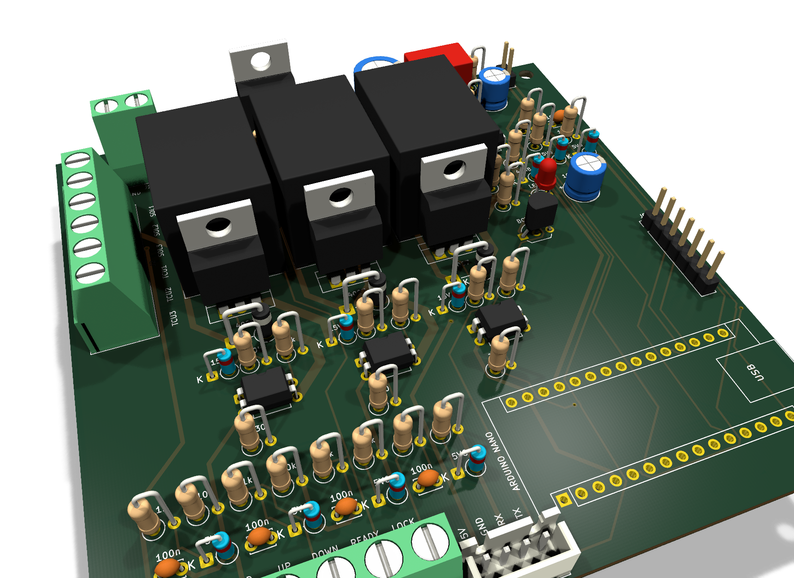

# AW4 shield – ovladač automatické převodovky Aisin AW4 pro Arduino Nano

Deska (shield) s Arduinem Nano, která:

* při přepínači **READY = vypnuto** nechá původní TCU připojené (převodovka běží jako sériově),
* při **READY = zapnuto** odpojí 3 vodiče solenoidů od původní TCU a převezme je (S1, S2, S3/lockup),
* čte spínače **UP, DOWN, READY, LOCKUP** (5 V z desky, aktivní = HIGH, s ochranou vstupu),
* zobrazuje zařazený stupeň na **displeji Nextion (UART)**, který má vlastní řadič a obraz si obnovuje sám, takže rušení na lince nanejvýš způsobí jeden chybný příkaz.



## Co je ve složce

| Cesta | Obsah |
|---|---|
| `kicad/` | **celý KiCad projekt** (schéma + PCB), formát KiCad 8, ověřeno v KiCadu 10.0.6 |
| `bom_objednavka.xlsx` | **seznam k objednání** (list *Objednávka*, počet desek se dá změnit), **postup osazení** (list *Osazení*) a **DigiKey** (výrobní čísla dílů) |
| `digikey_bom.csv` | soubor pro nahrání do DigiKey BOM Manageru (1 deska + rezerva u drobných dílů) |
| `docs/aw4_shield_ibom.html` | interaktivní BOM – klik na součástku ukáže, kam patří; odškrtávání osazených |
| `docs/aw4_shield_osazovaci_vykres.pdf` | osazovací výkres s označením součástek (R1, D12 …) |
| `fab/aw4_shield_gerber.zip` | Gerbery + vrtání pro výrobu DPS |
| `fab/drc_report.txt`, `fab/erc_report.txt` | výsledky kontrol z KiCadu |
| `docs/aw4_shield_schema_kicad.pdf` | schéma vyexportované z KiCadu |
| `docs/aw4_shield.pdf` | přehledové / vysvětlující schéma (3 strany) |
| `docs/aw4_shield_pcb.pdf`, `docs/pcb_*.png` | výkres DPS po vrstvách a 3D náhledy |
| `bom.csv` | strojový seznam součástek ze schématu |
| `firmware/aw4_controller.ino` | základní firmware (doladí se později) |
| `tools/` | skripty, kterými se schéma i deska generují |

## Podle servisního manuálu AW-4

* Solenoid se měří mezi **držákem (kostra převodovky) a drátem** → druhý konec solenoidu je na kostře, TCU na drát spíná **+12 V (high-side)**. Výstupy desky jsou proto high-side (P-MOSFET).
* Odpor cívky 11–15 Ω → **0,8–1,25 A na solenoid** (při 14,4 V až 1,3 A). Všechny tři najednou max. ~3,9 A.
* Solenoid 1 + 2 řadí stupně, **solenoid 3 = lockup**.
* Ověřit multimetrem na autě: že drátem solenoidu opravdu jde z TCU +12 V a že vodiče S1/S2/S3 jsou správně rozlišené (přehozené S1 a S2 = špatné řazení).

| Poloha / stupeň | Solenoid 1 | Solenoid 2 |
|---|---|---|
| P, R, N | ON | OFF |
| 1. | ON | OFF |
| 2. | ON | ON |
| 3. | OFF | ON |
| 4. (OD) | OFF | OFF |

Lockup (solenoid 3): v originále ve 2. jen v poloze 1-2, ve 3. v poloze 3 a ve 3. a 4. v poloze D. Řadicí páka a manuální ventil zůstávají mechanické, deska řídí jen elektrické solenoidy.

## Jak deska funguje

```
 J1 +12V (zapalování) ─[F1 5A]─[Q1 IRF4905, ochrana proti přepólování]─┬─ +12V_SW ─ cívky relé K1–K3, MOSFETy Q3–Q5
                                    D2 P6KE27A (TVS), C1 470µF, C2 100nF ┘
                                                                         └─[U1 TSR 1-2450]─[L1]─ +5V ─[JP1]─ Arduino Nano 5V
                                                                                                    └─ J3 spínače, J5 displej

 Vodiče solenoidů (3×) ──► K1/K2/K3 (přepínací kontakty SPDT):
        COM ← vodič k SOLENOIDU (J2: SOL1–3)
        NC  ← původní TCU (J2: TCU1–3) … klid = původní TCU řídí (fail-safe)
        NO  ← náš P-MOSFET Q3/Q4/Q5 (+12 V na solenoid)
```

### Stavy relé (fail-safe)

| READY přepínač | D8 | Relé K1–K3 | Solenoidy řídí |
|---|---|---|---|
| vypnuto | cokoli | odpadlé | původní TCU |
| zapnuto | HIGH / nezapojeno | odpadlé | původní TCU |
| zapnuto | LOW | přitažené | Arduino (Q3–Q5) |
| výpadek 12 V | – | odpadlé | původní TCU |

LED optočlenu relé (U3) je napájená **přes READY přepínač** a spíná ji pin D8 do země: vypnutí přepínače relé shodí i při zamrzlém firmwaru. Při výpadku Arduina drží pull-up 10 kΩ MOSFETy Q3–Q5 zavřené.

## Zapojení Arduina Nano

| Funkce | Pin | Poznámka |
|---|---|---|
| UP / DOWN / READY / LOCKUP | D4 / D5 / D6 / D7 | aktivní HIGH, 1 kΩ série, 10 kΩ pull-down, 100 nF, ESD |
| Relé K1–K3 | D8 | **LOW = přitáhnout** (jen při zapnutém READY) |
| SOL1 / SOL2 / SOL3 (lockup) | D9 / D10 / D11 | HIGH = +12 V na solenoid (opto U4/U5/U6 → Q3/Q4/Q5) |
| Displej Nextion | D3 (TX) / D2 (RX) | SoftwareSerial 9600 Bd, 100 Ω série + ESD |
| Rezerva (J6) | D12, D13, A0–A3 | D0/D1 jsou USB, nepoužité |

## Součástky – všechno vývodové (THT), pájí se ručně

Seznam k objednání i s počty je v `bom_objednavka.xlsx`. Hlavní díly:

| Ref | Součástka | Funkce |
|---|---|---|
| U2 | Arduino Nano | řízení (do 2× dutinkové lišty 1×15) |
| U1 | Traco TSR 1-2450 | spínaný stabilizátor 12 → 5 V / 1 A (formát 7805, vstup 6,5–36 V) |
| Q1 | IRF4905 (TO-220) | ochrana proti přepólování |
| Q3, Q4, Q5 | IRF9540N (TO-220) | high-side spínače solenoidů 1, 2, 3 |
| Q2 | BC337 (TO-92) | spínání cívek relé |
| K1, K2, K3 | Omron G5LE-1 DC12 (nebo pinově kompatibilní Songle SRD-12VDC-SL-C) | přepnutí solenoidu mezi původní TCU a desku |
| U3 / U4–U6 | PC817 (DIP-4) | optočlen relé / optočleny solenoidů |
| D12, D14, D16 | 1N4007 | flyback diody na straně solenoidu (za relé) |
| D2 | P6KE27A | transil (TVS) na napájení |
| D1 / D11, D13, D15 | BZX55C12 / BZX55C15 | ochrana gate MOSFETů |
| D3–D8 | BZX55C5V6 | ochrana vstupů a linky displeje |
| R2 | 0 Ω | jediné spojení výkonové (PGND) a logické (GND) země |
| F1 | patice TR5 + pojistka 5 A T | pojistka |

Rezistory 0,25 W a diody se montují **nastojato** (rozteč 2,54 / 5,08 mm), aby se vše vešlo na 100 × 100 mm.

## Deska plošných spojů

* **100 × 100 mm, 2 vrstvy, 1,6 mm** (nejlevnější rozměr u výrobců), 4× díra M3 v rozích. Doporučuji objednat **měď 2 oz** (s 1 oz to také funguje, cesty se víc ohřejí).
* **Na potisku je u každé součástky napsané, co se tam osazuje** (10k, 330, 5V6, 4007, 9540N, PC817 …), u konektorů a relé označení (J1, K1 …) a u svorkovnic názvy pinů (SOL1…TCU3, +12V/GND, +5V…LOCK, 5V/GND/RX/TX). Označení součástek (R18 …) je v osazovacím výkresu a v iBOM.
* Rozmístění: nahoře napájení (J1 → F1 → Q1 → D2 → C1 → U1 → L1/C4 → JP1), vlevo J2 (solenoidy/TCU) a tři relé, pod nimi MOSFETy, flyback diody a optočleny; vpravo budič relé a filtry displeje; vpravo dole Nano (USB přes pravou hranu); dole vstupní filtry, J3 (spínače) a J5 (displej).
* Šířky cest: +12 V a PGND **1,5 mm**, solenoidy/TCU **1,0 mm**, +5V/GND **0,6 mm**, signály 0,3 mm. Spodní vrstva: rozlitá měď PGND (výkonová část) a GND (logika), spojené jen přes R2.
* Cesty rozvedl autorouter (Freerouting). Kontroly v KiCadu 10.0.6: **DRC 0 chyb, 0 nepropojených, 0 rozdílů proti schématu, ERC 0 chyb / 0 varování.** Odstup mědi od hrany desky je nastaven na 0,3 mm (běžný limit výrobců, např. JLCPCB).

### Výroba
Nahrajte `fab/aw4_shield_gerber.zip` k výrobci (2 vrstvy, 1,6 mm, 100 × 100 mm, ideálně 2 oz Cu, HASL).

### Doporučený postup osazení
List *Osazení* v `bom_objednavka.xlsx` jde od nejnižších součástek: rezistory → diody (pozor na polaritu, proužek = katoda = čtvercový pad) → keramické C a ferity → optočleny, BC337, LED → lišty a patice → elektrolyty (polarita) → TO-220, TSR, patice pojistky → relé a svorkovnice → nakonec zasunout Nano.

### Před objednáním zkontrolovat v KiCadu
* Rozvedení je z autorouteru: funkčně kompletní a podle DRC v pořádku, ale stojí za to projít.
* Relé: číslování pinů je podle KiCad symbolu a footprintu G5LE-1 (cívka 2–5, COM 1, NC 4, NO 3). U jiného relé ověřit pinout.
* Ochrana vstupů je zenerkou 5,6 V (vývodové ESD diody se běžně nevyrábějí); s 1 kΩ / 100 Ω v sérii je to pro tento účel dostačující.

## Bude to fungovat? – revize zapojení a rizika

Výpočty klíčových míst (ověřeno při revizi):

* **Spínání solenoidů (Q3–Q5):** gate se přes dělič 10 kΩ / 1 kΩ stáhne na Vgs ≈ −11 V (při 14,4 V −13 V, zener 15 V chrání), IRF9540N při 1,3 A ztrácí ~0,2 W – bez chladiče. Optočlen potřebuje ~1,1 mA, při LED 11,5 mA a CTR ≥ 50 % má rezervu 5×.
* **Cívky relé (Q2):** 3 × ~30 mA = 90 mA. R14 = **2,2 kΩ** omezuje proud báze na ≤ 5 mA (v1 měla 220 Ω – při optočlenu s vysokým CTR by se rezistor spálil; opraveno).
* **Ochrana proti přepólování (Q1):** Vgs ≈ −11 až −12 V (zener 12 V), IRF4905 při 4 A ~0,3 W.
* **Vstupy:** sepnutý spínač dá na pin 4,5 V (dělič 1k/10k), Nano bere HIGH od 3 V.
* **Napájení 5 V:** Nano ~30 mA + optočleny ~50 mA + Nextion 2,4″ ~90 mA ≪ 1 A z TSR.

Ověřeno simulací (ngspice, `tools/spice/sim_channel.py`, optočlen s nejhorším i nejlepším CTR 50 % / 600 %):

| Veličina | 9 V | 12 V | 14,4 V | 27 V (transil) |
|---|---|---|---|---|
| Vgs spínače solenoidu Q3 | −8,1 V | −10,8 V | −13,0 V | −15 V (zener) |
| Proud solenoidem (12 Ω) | – | 0,99 A | 1,18 A | – |
| Úbytek na Q1 (přepólování) | – | 18 mV | 22 mV | – |
| Q2 sepnutý (napětí na cívkách relé) | 0,12 V | 0,13 V | 0,15 V | 0,2 V |

* Sepnutí solenoidu 0,7 ms, vypnutí ~2,5 ms; flyback dioda drží výstup na −1 V (žádná špička), MOSFET nikdy nevidí víc než napájení. Cívky relé při vypnutí max. 15,3 V (BC337 snese 45 V).
* R14 = 2,2 kΩ: 5–6 mA, 56–83 mW. **S původními 220 Ω by to bylo ~59 mA / 0,8 W – rezistor by shořel.**
* Firmware: přeložen pro ATmega328P bez chyb a varování (`-Wall -Wextra`, 6,1 kB flash), logika ověřena testem `firmware/test/run_test.sh` (řazení podle tabulky, lockup jen od 3., debounce, pořadí přepnutí relé a výstupů, obnovování displeje).

Co z desky nejde poznat a je potřeba ověřit / dát pozor:

1. **Polarita solenoidů v autě** – návrh počítá s tím, že TCU spíná na drát +12 V a druhý konec solenoidu je na kostře (podle manuálu). Ověřit multimetrem.
2. **Zem:** PGND (J1) musí být spolehlivě spojený s kostrou / mínusem baterie – přes kostru se vrací proud solenoidů.
3. **Původní TCU po přepnutí zpět** může mít zapsanou chybu (viděla rozpojené solenoidy) a jet v nouzovém režimu do dalšího otočení klíčkem.
4. **Bezpečnost řazení je na firmwaru** – deska nemá vstup rychlosti, takže nic nebrání podřazení do 1. při vysoké rychlosti. Doporučuji přidat čidlo rychlosti na rezervní vstup (J6, A0–A3) a ve firmwaru blokovat podřazení.
5. **READY zapínat ve stoje** (firmware po READY nastaví 1. stupeň).
6. **Neprovozovat se sundaným JP1:** pokud je Nano bez napájení a READY zapnuté, mohou relé přitáhnout a solenoidy zůstanou bez proudu (= 4. stupeň).
7. První zapnutí: nejdřív bez Nana a bez připojené převodovky změřit 5 V za TSR, pak Nano, pak zkoušet relé a výstupy na žárovce 12 V / 21 W místo solenoidu.

## Objednání u DigiKey
Na digikey.com (nebo digikey.cz) → *BOM Manager* → *Upload a BOM* → nahrát `digikey_bom.csv` (sloupce *Manufacturer Part Number*, *Manufacturer*, *Quantity*, *Customer Reference*). DigiKey díly spáruje podle výrobního čísla. Pro víc desek upravte množství v listu *DigiKey* v `bom_objednavka.xlsx` (počet desek je na listu *Objednávka*).
* Dostupnost a ceny nebyly ověřené (DigiKey nebyl z prostředí, kde podklady vznikly, dostupný). Pokud některý díl není skladem, BOM Manager nabídne náhradu – hodnota a pouzdro musí zůstat stejné (rozteč vývodů!).
* Pojistka TR5 a její patice jsou označené *OVĚŘIT* – zkontrolujte při nahrání.
* Displej Nextion DigiKey nevede (koupit přímo u Nextion/Itead nebo v e-shopech), distanční sloupky M3 libovolné.

## Napájení Nana a programování
JP1 spojuje +5 V desky s pinem 5V Nana. **Při programování po USB jumper sundejte** (nebo odpojte 12 V), nikdy nenapájet z obou stran zároveň.

## Původní TCU
Po odpojení (READY zapnuto) vidí původní TCU rozpojený obvod a může si zapsat chybu. Atrapu zátěže na straně TCU nepoužívejte: NC kontakt je v klidu trvale připojený k solenoidu, atrapa by byla neustále paralelně a TCU by viděla poloviční odpor.

## Displej Nextion
Nextion Basic NX3224T024 (2,4″) nebo NX4024T032 (3,2″), 5 V, UART. Má vlastní řadič a obraz si obnovuje sám; firmware stav posílá znovu každých ~0,5 s. Kabel k displeji kroucený nebo stíněný (stínění jen na straně desky).

## Firmware
`firmware/aw4_controller.ino` – základní logika (UP/DOWN, lockup, READY, displej Nextion přes SoftwareSerial). Bude se dolaďovat. Pozor: D8 je aktivní LOW.

## Jak byly schéma a deska vytvořené (`tools/`)
Schéma generuje `tools/kgen.py` (sítě, symboly, footprinty, BOM), desku `tools/build_pcb.py` (rozmístění, netclassy, zóny) přes Python API KiCadu 10, rozvedení Freerouting (`run_all.sh`), úklid a exporty `cleanup.py` a `export.sh`. Cesty ve skriptech odpovídají prostředí, kde vznikly, a je potřeba je upravit. Další úpravy se dají dělat rovnou v KiCadu: schéma i deska jsou běžné KiCad soubory a *Update PCB from Schematic* funguje.
