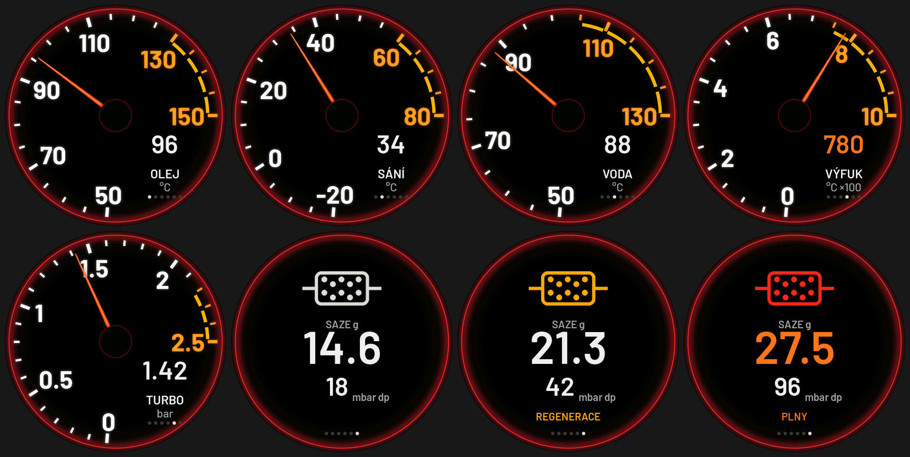

# NOT STOCK A4 gauge

A small round gauge for an **Audi A4 B8 2.0 TDI** (2010), drawn after the
car's own cluster at night: red lit rim, white dashes and numerals, the
warning range orange with a broken amber band inside the ticks, an
orange-red needle on a black hub, the value and name in the lower right
where the cluster has its "1/min x1000". No maker's logo.

Board: **Waveshare ESP32-S3-Touch-AMOLED-1.32** (466 x 466 CO5300 on
QSPI, CST820 touch, ES8311 + speaker, ESP32-S3-PICO-1-N8R8: 8 MB flash,
8 MB PSRAM).



Oil, intake, coolant, exhaust, boost, DPF (plain, regenerating, full).

**State: built; the dials checked in the simulator. Not tried on the board
or the car yet.**

## The dials

Swipe left / right; the page is remembered. Double tap: night (30 %) and
back. At power on the NOT STOCK logo, then the needle sweeps to full scale
and back, as the cluster does.

| Dial | Scale | Orange from |
| --- | --- | --- |
| OLEJ (oil) | 50 .. 150 degC | 130 |
| SANI (intake air) | -20 .. 80 degC | 60 |
| VODA (coolant) | 50 .. 130 degC | 105 |
| VYFUK (exhaust gas) | 0 .. 1000 degC (x100) | 750 |
| TURBO (boost) | 0 .. 2.5 bar | 2.2 |
| DPF | no scale: icon and digits | 24 g soot |

Past the limit the value turns orange and blinks. The DPF page: the filter
icon (white; amber while it regenerates, red and blinking when full), the
soot in grams, the differential pressure in mbar, REGENERACE / PLNY.

A regeneration (the filter hotter than 400 degC, over below 350, as on
the round gauge) lights the amber DPF lamp left of the hub and says
REGENERACE over the value on every dial, with a chime on the speaker at
its start and its end.

Scales and limits: `DIAL[]` in `main/ui_a4.c` and `PAGES` in
`tools/gen_faces.py` (the dials are pre-rendered images: change both, then
`python3 tools/gen_faces.py`).

## The car

OBD-II on the B8's diagnostic CAN (500 kbit, OBD pins 6 CAN-H and 14
CAN-L), the round gauge's client (`../notstock-round/main/can_obd.c`,
`../notstock-dash-7inch/main/obd2.c`):

- standard OBD-II: coolant, intake air, boost (MAP - baro), exhaust gas
  temperature, rpm;
- VW UDS measuring values: oil temperature (0x11BE), DPF soot (0x114F,
  0x114E), differential pressure, filter temperature. These were
  checked on the T5.1's EDC17; the B8's 2.0 TDI (CR, EDC17) should know
  them too, but that is untested: if one stays at `--`, the log shows
  what the engine answered.

Wiring: an SN65HVD230 board on the 12-pin header J1:

| SN65HVD230 | J1 pin | |
| --- | --- | --- |
| GND | 1 | GND |
| 3V3 | 3 | 3V3 |
| CTX | 5 | GPIO1 |
| CRX | 6 | GPIO2 |

CAN-H / CAN-L to OBD pins 6 / 14 (the car's bus is terminated, no 120 R
at the gauge). Power: 5 V into the USB-C from a 12 V -> 5 V converter fed
from OBD pin 16 (always on) or, switched with the ignition, pin 1 if the
B8 has terminal 15 there: measure it, 12 V with the ignition on, 0 V off.

## Build and flash

ESP-IDF 5.x, LVGL 8.4 from the component manager, with
`../notstock-round`, `../notstock-round-amoled` and `../notstock-dash-7inch`
beside this folder:

```
idf.py set-target esp32s3
idf.py build
idf.py -p COM9 flash monitor
```

New source files are picked up at configure time: `idf.py reconfigure`.

## Simulator

```
make -C tools/sim LVGL_DIR=/path/to/lvgl-8.4
tools/sim/build/sim out.ppm page=5 soot=21.3 dp=42 dpft=520
```

Fonts: Barlow (SIL OFL, `assets/fonts/OFL-Barlow.txt`).
