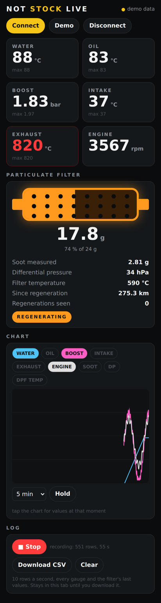

# NOT STOCK Live

The round gauge's data in a browser, over Bluetooth LE: live values, the
particulate filter, a chart and a CSV log. One HTML file, nothing to
install, no app store.

- **Connect**: picks a gauge advertising as `NOTSTOCK ...` and subscribes
  to its GAUGES (10 Hz) and DPF (1 Hz) notifications
  (`../notstock-round/docs/BLE.md`).
- **Demo**: made-up data through the same parsers, a regeneration in the
  middle; everything works without a gauge.
- Tiles go red over the same default limits as the gauge; max since the
  page opened (not for rpm).
- Particulate filter: soot as a filling filter, measured soot, differential
  pressure, filter temperature, km since regeneration; it glows orange and
  a toast pops (and the phone vibrates) when a regeneration starts or ends.
- Chart: pick channels, 1 / 5 / 15 min; tap it to freeze it and read every
  shown channel at that moment, Live to go on.
- Log: Record / Stop, 10 rows a second, Download CSV.

## Where it runs

Web Bluetooth needs Chrome or Edge (Android, Windows, macOS, ChromeOS,
Linux). iPhone: Safari has none, the free Bluefy browser does. The page has
to be served over https (or localhost), not opened as a file: GitHub
Pages, Netlify or any https host will do, and once loaded it is one file.

Not tried against a gauge yet: the BLE side of the firmware comes with the
2.1" board. The protocol itself is checked between the C packer and this
page's parsers.
