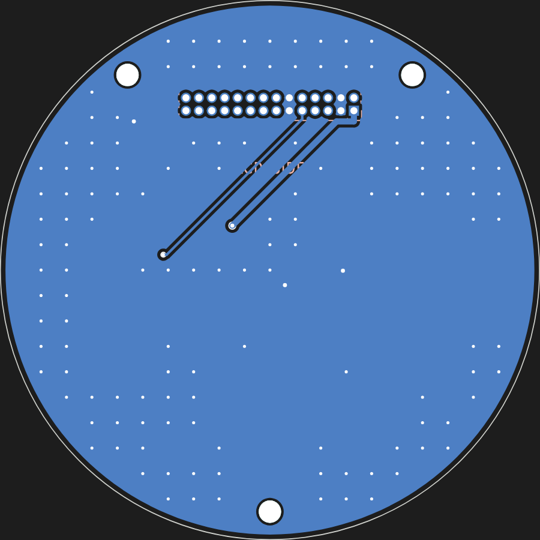

# NOT STOCK CAN 1.85

A round board that plugs onto the back of the **Waveshare
ESP32-S3-Touch-LCD-1.85** and turns the car's OBD supply and CAN into what
the round gauge needs: 12 V in, 5 V for the display, a CAN transceiver on
two of its GPIOs. One 4-wire cable from the OBD plug, nothing else.

 

KiCad 7 project: `notstock-can185.kicad_pro` (schematic, PCB). Schematic as
PDF: [docs/schematic.pdf](docs/schematic.pdf). Placement:
[docs/assembly.png](docs/assembly.png).

**State: designed, DRC clean (0 errors, 0 unconnected), not built.** Read
[Before ordering](#before-ordering) first.

## What is on it

| Block | Parts |
| --- | --- |
| Input | J1 JST PH 4-pin SMD (12 V, GND, CAN-H, CAN-L); F1 0.5 A resettable fuse; D1 SS16 against reverse polarity; D2 SMAJ26A against load dump |
| 12 V -> 5 V | U1 LMR16006YDDCR (60 V, 0.6 A, 700 kHz), L1 22 uH, D3 PMEG6010CEH, 2 x 22 uF out; 56 k / 10 k sets 5.05 V |
| CAN | U2 TJA1051T/3 (5 V supply, 3.3 V logic from the display); D4 NUP2105L ESD; R4/R5/C8 split termination behind JP1, open |
| Display | J2 2 x 14 socket, 1.27 mm, on the back: 5 V in, 3V3, GND, GPIO12 (TX), GPIO13 (RX) |
| Mechanics | Ø 53 mm, three M2 holes matching the display's (23.75 mm radius) |

The display pins it uses, as Waveshare's 1.85C schematic numbers its
header: 1 USB_5V, 3/4/11/12 GND, 9/10 3V3, 18 GPIO13, 20 GPIO12. The other
pins are left open. The firmware (`../notstock-round-lcd185`) has CAN on
GPIO12/13.

Termination: the car's bus is terminated at both ends already, so JP1
stays open. Bridge it only on a bench with no other terminator.

## Cable

JST PHR-4 housing with SPH-002T-P0.5S crimps on the board side; at the OBD
plug: pin 16 +12 V, pin 4 or 5 GND, pin 6 CAN-H, pin 14 CAN-L. CAN-H and
CAN-L twisted. Pin 1 of J1 is marked 12V on the board.

## Before ordering

The mechanics and the header pinout come from Waveshare's drawing and
schematic of the **ESP32-S3-Touch-LCD-1.85C** (their hardware folder); the
1.85 shares the header and the board, as far as can be told, but check on
the real board:

1. **Pin 1 of the 28-pin header.** Its silkscreen marks pin 1. On this
   board pin 1 (5 V) is the left end of the row nearer the centre, seen
   from behind with the header at the top (the "1" and "5V" on the
   silkscreen). If the display has it at the other end, set
   `PIN1_END = "right"` and `ODD_ROW = "outer"` in `tools/design.py` and
   regenerate. A mirrored board puts 5 V on a GPIO.
2. **Which pins are which.** USB_5V on pin 1, 3V3 on 9/10, GPIO13 on 18,
   GPIO12 on 20, against the 1.85's own pin table.
3. **Gender and height.** J2 has to mate with what the display has (pins or
   a socket). The board then sits at the mated height behind the display;
   the parts on the display's back must fit under it.
4. **The three holes.** M2, at the positions of the display's mounting
   holes; spacers to the mated header height.

## Make it

PCB: `fab/notstock-can185-gerbers.zip` (2 layers, 1.6 mm, any colour) to
JLCPCB or similar. Assembly: `fab/bom.csv` and `fab/cpl.csv` are in
JLCPCB's columns; the LCSC numbers are to be filled in when ordering
(stock changes), and check the part rotations in their preview. J2 is
through-hole on the back: solder it by hand. Everything else is on the top.

## Regenerate

Everything is generated from `tools/design.py` (parts, nets, positions):

```
python3 tools/gen_sch.py                       # the schematic
kicad-cli sch export netlist -o /tmp/n.net notstock-can185.kicad_sch
python3 tools/check_net.py /tmp/n.net          # schematic = design.py
python3 tools/gen_pcb.py --freerouting freerouting-2.0.1.jar
python3 tools/drc_summary.py                   # DRC of the routed board
python3 tools/gen_fab.py                       # fab/ and docs/
```

Needs KiCad 7 with its python module and libraries, Java 21 and
[Freerouting](https://github.com/freerouting/freerouting) 2.x for the
routing. Freerouting is not deterministic: each run gives a different (and
DRC-checked) routing. Opened in KiCad, the project behaves like any other;
the generators overwrite manual changes, so after editing by hand stop
using them.
