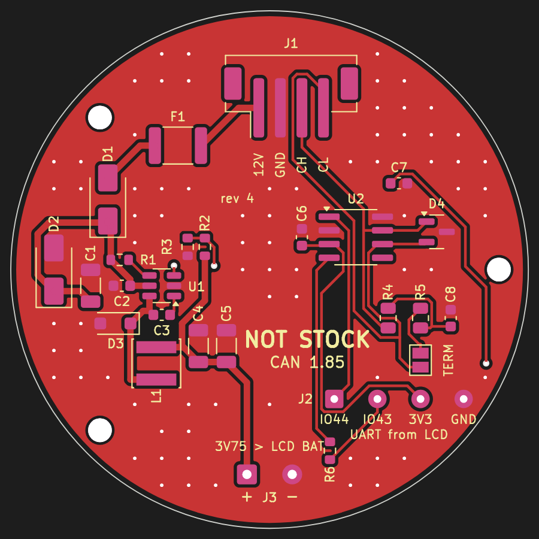

# NOT STOCK CAN 1.85

A round board that sits behind the **Waveshare ESP32-S3-Touch-LCD-1.85**
(SKU 28514) on its three M2 holes and turns the car's OBD supply and CAN
into what the round gauge needs. One 4-wire cable from the OBD plug; to
the display the 4-wire cable that comes with it (CAN) and two wires
(power), all soldered to pads on this board.



KiCad 7 project: `notstock-can185.kicad_pro` (schematic, PCB). Schematic as
PDF: [docs/schematic.pdf](docs/schematic.pdf). Placement:
[docs/assembly.png](docs/assembly.png).

**State: rev 4, designed, DRC clean (0 errors, 0 unconnected), ready to
order with assembly; not built yet.** Rev 4 feeds the display through its
battery socket instead of its USB-C (no room for a USB cable).

## How it connects

The display has no plug-on header. What it has, and what this board uses
(Waveshare's schematic and drawing of the board, `ESP32-S3-LCD-1.85`):

| Display | Cable | This board |
| --- | --- | --- |
| battery socket J1, MX1.25 2-pin (1 BAT, 2 GND); seen from the back with the USB-C down, the 2-pin socket on the left | MX1.25 2-pin plug with wires, or two wires soldered to the socket's pins | J3 pads: "+" to BAT, "-" to GND, 3.75 V |
| UART socket, 4-pin 1.0 mm, bottom right (1 RXD/GPIO44, 2 TXD/GPIO43, 3 3V3, 4 GND) | the 4-wire cable that comes with the display, free ends cut to length | J2 pads, marked with the display's names: IO44, IO43, 3V3, GND (CAN, and the display's 3.3 V for the transceiver) |
| three M2 holes (15.73 left, 14.10 up / 14.90 down; 21.27 right) | M2 spacers, 6 to 8 mm | H1..H3 |

The car: J1, JST PH 4-pin (12V, GND, CAN-H, CAN-L, marked on the board).

GPIO44 is CAN TX, GPIO43 CAN RX: `../notstock-round-lcd185` is set up for
it. The boot ROM prints on GPIO43 for a moment after every reset; R6 (1 k)
keeps that from fighting the transceiver's RXD. Flashing: through the
display's USB-C, with the battery wires unplugged from the display (its
charger would otherwise push 4.2 V back into this board).

### The display's power button must be bridged

Behind the display's battery socket sits a switch (Q1, AO3401) that only
the power button Key1 turns on; the ESP32 then holds it on (GPIO7). On the
battery input alone the display never starts by itself, at any voltage.
Bridge Key1's two pads with solder or a short wire: the switch is then on
whenever the board gets power. The firmware does not use the button
(GPIO6) or GPIO7; the button just no longer turns the display off. Check
before bridging which two of the button's pads are the switch (a meter
across them shows a short only while pressed).

Why 3.75 V: a Li-ion cell's middle; the display's 3.3 V regulator (ME6217)
keeps its margin, its speaker amplifier runs from it.

## What is on it

| Block | Parts |
| --- | --- |
| Input | J1 JST PH 4-pin SMD; F1 0.5 A resettable fuse; D1 SS16 against reverse polarity; D2 SMAJ26A against load dump |
| 12 V -> 3.75 V | U1 LMR16006YDDCR (60 V, 0.6 A, 700 kHz), L1 22 uH, D3 PMEG6010CEH, 2 x 22 uF out; 39 k / 10 k sets 3.75 V |
| 3.75 V out | J3, two solder pads for the wires to the display's battery socket |
| CAN | U2 SN65HVD230 (3.3 V from the display's UART socket, Rs to GND: full speed); D4 NUP2105L ESD; R4/R5/C8 split termination behind JP1, open, not assembled; R6 1 k in RXD |
| Mechanics | Ø 48 mm like the display, the display's three M2 holes |

Termination: the car's bus is terminated at both ends already, so JP1
stays open. Bridge it only on a bench with no other terminator.

## Cable to the car

JST PHR-4 housing with SPH-002T-P0.5S crimps on the board side; at the OBD
plug: pin 16 +12 V, pin 4 or 5 GND, pin 6 CAN-H, pin 14 CAN-L. CAN-H and
CAN-L twisted.

## Check before ordering

- Which wire is which on the display's cable: the colours mean nothing.
  Plugged into the display, powered from its USB: 3.3 V between the 3V3
  wire and the GND wire. With the display unpowered, the GND wire beeps to
  the USB-C shell. Of the other two, IO44 is on socket pin 1 (next to the
  edge marked 1 or the triangle on the display's silkscreen).
- The battery plug's polarity: ready-made MX1.25 cables come both ways.
  Red is not proof: with the plug in the display, the wire on the
  display's "+" (or BAT) side goes to J3 "+".
- Height: the spacers must clear the display's tallest parts (USB-C, SD
  slot, the 1.0 mm sockets, about 4.5 mm) plus the cables' plugs. The wire
  pads are through holes: solder the wires from the display's side, or
  from the back with the ends trimmed flat.
- Waveshare's drawing was the source of the outline and the holes; hold
  the printed board (1:1 PDF of `docs/top.svg`) against the display first.

## Make it (JLCPCB, with assembly)

Three files in `fab/`:

| File | Where on JLCPCB |
| --- | --- |
| `notstock-can185-gerbers.zip` | "Add gerber file": 2 layers, 1.6 mm, any colour |
| `bom.csv` | PCB Assembly, "Add BOM File" |
| `cpl.csv` | PCB Assembly, "Add CPL File" |

Assembly: top side only, all SMD. Every part has its LCSC number in
`bom.csv` (also in the schematic and on the footprints, field "LCSC"):

| Ref | Part | LCSC |
| --- | --- | --- |
| U1 | TI LMR16006YDDCR | C290195 |
| U2 | TI SN65HVD230DR | C12084 |
| D4 | onsemi NUP2105LT1G | C14486 |
| D1 | SS16 (UMW) | C2758574 |
| D2 | SMAJ26A | C383018 |
| D3 | Nexperia PMEG6010CEH | C110797 |
| F1 | SMD1812P050TF/30 (RUILON) | C12559 |
| L1 | Sunlord SWPA4026S220MT | C88254 |
| J1 | JST B4B-PH-SM4-TB | C160354 |
| C1 | 4.7 uF 50 V 1206 (Murata) | C77096 |
| C2, C3, C6, C7 | 100 nF 50 V 0603 (YAGEO) | C14663 |
| C4, C5 | 22 uF 16 V 1206 (Samsung) | C90146 |
| R1 | 100 k 0603 | C25803 |
| R2 | 39 k 0603 | C23153 |
| R3 | 10 k 0603 | C25804 |
| R6 | 1 k 0603 | C21190 |

R4, R5 and C8 (the split termination) are not assembled: with JP1 open
they do nothing, and the car's bus is terminated already. For a bench
without a terminator solder them by hand: R4, R5 any 0805 56..62 R 1 %, C8
4.7 nF 0603 (C53987), then bridge JP1.

JP1 is a solder bridge, J2 and J3 pads for wires: not parts. Stock changes: JLCPCB marks a part out
of stock in the BOM step; pick an equivalent there (same value, package,
voltage). The passives are JLCPCB basic parts, the rest extended (a small
loading fee each).

In the placement preview, check the parts with a direction: U1 (pin 1 dot),
U2 (pin 1 at the notch), D4, D1/D2/D3 (the band towards the "K" side of the
footprint's silkscreen), J1 (opening upwards). KiCad and JLCPCB do not always agree on rotations; turn any
that are off in 90° steps there.

## Regenerate

Everything is generated from `tools/design.py` (parts, nets, positions):

```
python3 tools/gen_sch.py                       # the schematic
kicad-cli sch export netlist -o /tmp/n.net notstock-can185.kicad_sch
python3 tools/check_net.py /tmp/n.net          # schematic = design.py
python3 tools/gen_pcb.py --freerouting freerouting-2.0.1.jar
python3 tools/drc_summary.py                   # DRC of the routed board
python3 tools/gen_fab.py                       # fab/ and docs/
```

Needs KiCad 7 with its python module and libraries, Java 21 and
[Freerouting](https://github.com/freerouting/freerouting) 2.x for the
routing. Freerouting is not deterministic: each run gives a different (and
DRC-checked) routing. Opened in KiCad, the project behaves like any other;
the generators overwrite manual changes, so after editing by hand stop
using them.
