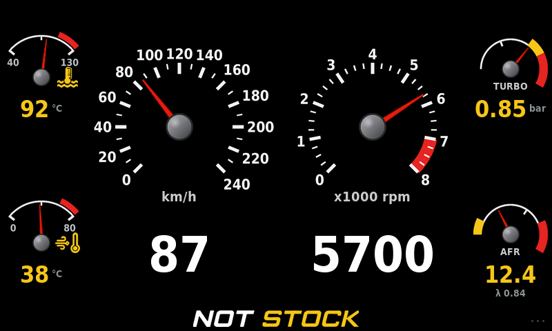

# NOT STOCK dash - ESP32-S3-Touch-LCD-7 + rusEFI (uaEFI)

Standalone gauge cluster for the **Waveshare ESP32-S3-Touch-LCD-7** (800x480).
No Raspberry Pi, no operating system, no SquareLine Studio. Reads rusEFI's
verbose CAN broadcast over the board's onboard TJA1051 transceiver and draws
the dash with hand-written LVGL. Boots in well under a second and does not care
if you cut power mid-frame.



## What is on the screen

A classic analogue cluster. Every gauge has a needle **and** a digital readout.

| Where | Gauge | Scale | Readout |
| --- | --- | --- | --- |
| centre left | speedometer | 0-240 km/h | km/h |
| centre right | rev counter | 0-8 x1000, red from 7000 | rpm, to 10 |
| left top | water temperature | 40-130 degC, red from 105 | degC, icon |
| left bottom | intake air temperature | 0-80 degC, red from 60 | degC, icon |
| right top | turbo | -1.0-2.0 bar, yellow 0.8-1.2, red from 1.2 | bar |
| right bottom | AFR | 10-18, yellow under 11, red over 16 | AFR and lambda |

**No warning lamps.** A value past its limit (settings menu) turns its own
readout red, the temperature icons go red with it. The only thing that
flashes is the shift light, see below. The one piece of text that can appear
is `NO CAN` (red) or `DEMO` (yellow) at the top, and only while the needles are
not showing live data.

## Changing the look

Two layers, each with one place to edit:

**The artwork**: `tools/gen_dials.py`. Scales, tick spacing, zones, colours,
needle and hub sizes are constants at the top. It draws everything in Pillow
at 4x supersampling and writes

- `main/dials.c`, RGB565 / RGBA image data,
- `main/dials.h`, the matching geometry: sweep angles, ranges, redline,
  needle pivots,
- `build_art/*.png`, the same images for a quick look.

`ui.c` takes every range and angle from `dials.h`, so a changed scale cannot
drift out of step with the needle.

**Icons and wordmark**: `tools/gen_assets.py` traces the water and intake
icons out of `assets/icons_sheet.png` and the NOT STOCK wordmark out of
`assets/mockup.jpg` into `main/icons.c` and `main/logo.c`. Replace the source
file and re-run it; `ui.c` places icons by their centre, so a different size
needs no layout edit.

**The layout**: the `LY_*` block at the top of `main/ui.c`. Every gauge is
placed by its pivot, readouts by an offset from that pivot. Colours are the
`C_*` defines, needle lag is `NEEDLE_SMOOTH`.

```bash
python tools/gen_dials.py     # after changing the artwork
python tools/preview.py       # renders preview/*.png
idf.py build flash
```

### Previewing on the PC

`tools/preview.py` compiles the real `ui.c`, `ui_menu.c`, `settings.c`, fonts
and artwork together with LVGL for the PC (`tools/sim/`) and renders frames
into `preview/`. Nothing in it re-implements the layout, so the PNG is what
the panel shows, pixel for pixel. Standard scenes: normal driving, everything
past its limit, idle, no CAN, settings menu. For one custom frame:

```bash
python tools/preview.py rpm=6500 speed=140 clt=96 iat=41 boost=1.35 afr=11.8
python tools/preview.py link=0          # NO CAN
python tools/preview.py demo=1 t=3.2    # demo generator at 3.2 s
```

Needs `make`, a C compiler and Pillow. LVGL is taken from
`managed_components/` after one `idf.py build`, or from `LVGL_DIR`.

### Why the artwork is pre-rendered

The scales never change, so they are not rebuilt from LVGL primitives every
frame. A blit is cheaper than dozens of line and arc draws and looks far
better: LVGL 8 cannot antialias hairline ticks or hint small labels. At
runtime LVGL only rotates the needle images and rewrites the numbers.

Each face is a plain image centred on its pivot, with a transparent
`lv_meter` on top that only draws the needle. The meter is not given the face
as its background because `lv_meter` puts its centre at (w/2, w/2) from the
top-left, which only works for square images, and the side gauges are not
square.

The rev counter scale and redline are baked in. Change `RPM_MAX` /
`RPM_REDLINE` in `gen_dials.py` and re-run it; there is no menu setting for
them any more.

## Which board

This copy is built for the **Waveshare ESP32-S3-Touch-LCD-7** (800x480, N8R8).
It is a port of the working 5 inch build. The layout, CAN decoding and menu are
identical; only the board support changed. Both boards are handled by
`DASH_BOARD` in `main/board.h`, here set to `BOARD_WS_LCD7`.

| | this project (7 inch) | 5 inch |
| --- | --- | --- |
| `DASH_BOARD` | `BOARD_WS_LCD7` | `BOARD_WS_LCD5` |
| CAN TX / RX | GPIO20 / GPIO19 | GPIO15 / GPIO16 |
| CAN pins shared with USB OTG | yes, EXIO5 selects | no, dedicated |
| EXIO5 | CAN/USB selector, driven high | DI1, an isolated input |
| Module | N8R8, 8 MB flash | N16R8, 16 MB flash |
| Console | UART0 via CH343 ("UART" Type-C) | USB Serial/JTAG |

The RGB data and sync pins are identical on both, which is why a picture
appears either way. Flashing the wrong build gives a working picture but dead
CAN.

## Build

Needs ESP-IDF 5.1 or newer.

```bash
idf.py set-target esp32s3
idf.py build
idf.py -p COMx flash monitor
```

LVGL 8.4 is pulled automatically by the component manager and configured
entirely through `sdkconfig.defaults`, so there is no `lv_conf.h` to babysit.

If you built the 5 inch project in the same folder before, run
`idf.py fullclean` and delete `sdkconfig` first, otherwise the old 16 MB /
USB-console values survive in it and `sdkconfig.defaults` is ignored.

### Two Type-C ports, use the UART one

The 7 inch has two Type-C ports:

- **UART**: CH343 USB-UART bridge on GPIO43/44. Flash and `idf.py monitor`
  go through this one. It shows up as a CH343 COM port (Windows may need the
  WCH driver).
- **USB**: the ESP32-S3 native USB on GPIO19/20. **Dead while the dash runs.**
  GPIO19/20 are also the CAN pins, and the firmware drives EXIO5 on the
  CH422G high at boot, which switches them from USB to the CAN transceiver.

`sdkconfig.defaults` therefore keeps the log console on UART0.

### Flash size and partitions

`sdkconfig.defaults` is set to 8 MB to match the N8R8 module. The stock
`SINGLE_APP_LARGE` table caps the app at 1.5 MB, which the baked dial artwork
gets close to, so `partitions.csv` gives the app almost all of the 8 MB
(nvs, phy_init, one 7.9 MB factory app).

## Settings menu

**Long-press the bottom-right corner of the screen** for about half a second.
The hit area is invisible apart from three dim dots; nothing about normal
driving opens it. Values apply live as you adjust them, SAVE & CLOSE writes
them to NVS so they survive a power cut, DEFAULTS puts everything back.

The build stamp sits bottom right of that screen: `NOT STOCK v2.0` over the
compile date, the LVGL version and the IDF version. `DASH_VERSION` in
`main/ui_menu.h` is the bit to bump.

| Setting | Range | Notes |
| --- | --- | --- |
| Shift flash | on/off | master switch for the full-screen red flash |
| Shift flash at | 0-9000 rpm | 0 disables it |
| Shift flash level | 10-100 % | peak opacity of the red wash |
| Water temp | 60-130 degC | readout red at or above |
| Intake air temp | 20-120 degC | readout red at or above |
| Boost limit | 0-2.5 bar | readout red at or above, 0 disables |
| AFR lean limit | 0-20.0 | readout red at or above, 0 disables |
| Brightness | 15-100 % | see the note below |
| Fuel | Petrol / E85 | sets stoichiometric AFR, 14.7 or 9.8 |
| Baro offset | 0.80-1.10 bar | what gets subtracted from MAP for boost |
| Demo mode | on/off | synthetic data, no reflash needed |

The rev counter readout goes red at the baked redline.

Settings are stored with a version number. This build changed the stored
layout, so the first boot after flashing it starts from the defaults.

**Brightness is software, not backlight.** EXIO2 on the CH422G is a plain
display-enable line with no PWM, so there is no way to dim the LEDs from
firmware. The setting lays a black wash over the picture instead, which lowers
apparent brightness but not power draw or black level. That is why it stops at
15 %.

## Shift flash

**Revs are the only thing that flashes the screen.** Every other limit turns
its own readout red and leaves it at that. Temperatures and pressures creep,
and strobing the panel while the driver is trying to read the number that
caused it is worse than useless. Revs are the one case where the reaction has
to happen inside a second, with your eyes on the road.

Above the set rpm the whole screen pulses red with a 420 ms period. It is a
square wave rather than a fade, because a hard flash is far more noticeable in
daylight and costs one opacity write per half period rather than one per
frame. The wash sits on LVGL's top layer, so it covers the dash but does not
block the menu, and the brightness dim sits above it on the system layer so a
dimmed screen also has a dimmer flash.

## Bench test without the car

Turn on Demo mode in the settings menu. A synthetic generator sweeps every
gauge and the top line reads DEMO. No rebuild, no reflash.

## Touch

GT911 on the shared I2C bus, address 0x5D, INT on GPIO4, reset on CH422G EXIO1.

**Coordinates are scaled, not clipped.** This board ships in 800x480 and
1024x600 flavours and the touch controller carries its own configuration, so it
can report on a different grid than the panel actually has. The driver reads
the controller's configured X and Y maxima at boot and scales every point onto
the panel. An earlier version discarded anything at or beyond 800x480, which on
a 1024x600 controller silently threw away the entire right and bottom of the
screen, including the corner the settings menu lives in.

The boot log states both grids:

```
GT911 at 0x5D, id 911, controller grid 1024x600, panel 800x480  -> scaling
```

and every press logs one line, `touch 743,451`. If presses appear in the log
but land in the wrong place, the scaling numbers in that boot line are the
thing to look at. If nothing appears at all, check the i2c scan line for 0x5D.
The INT line doubles as the address select during reset, so the driver holds it
low, releases reset, then hands the pin back as an input. If the controller
does not answer on 0x5D it retries 0x14. A failed probe is not fatal: the dash
runs as before, only the menu becomes unreachable.

## Wiring

| Board | To |
| --- | --- |
| CAN terminal H / L | rusEFI CAN H / L, twisted pair |
| CAN 120R | the 7 inch has a termination jumper. Leave it fitted if the dash is the far end of the bus, remove it otherwise |
| 5V | 12V to 5V buck, 1A minimum, switched with ignition |

Draw is roughly 450 mA at 5V with the backlight up.

## rusEFI side (TunerStudio, CAN bus settings)

- Enable rusEFI verbose CAN: **on**
- rusEFI CAN data base address: **512** (0x200)
- ID width: **11 bit**
- Bitrate: **500 kbit** (match `CAN_BITRATE_500` in `main/rusefi_can.h`)
- Can Dash Type: **None**

On uaEFI the CAN pair is on the main connector; see the
[uaEFI pinout](https://github.com/rusefi/rusefi/wiki/uaEFI).

The dash runs TWAI in normal mode, not listen-only, on purpose. On a two node
bus the dash has to acknowledge frames or rusEFI piles up transmit errors and
eventually drops to bus-off. It never queues a transmission of its own
(`tx_queue_len = 0`).

Decoded frames, from
[can_verbose.cpp](https://github.com/rusefi/rusefi/blob/master/firmware/controllers/can/can_verbose.cpp).
The decoder still reads everything it did before; the screen uses the rows
marked in bold.

| ID | Contents |
| --- | --- |
| base+0 | Status: fan / fan2, check engine, rev limit |
| base+1 | **RPM**, ignition timing, injector duty, **VSS** |
| base+2 | TPS |
| base+3 | **MAP** (boost = MAP - baro), **coolant**, **intake air temp** |
| base+4 | oil pressure, oil temp, battery voltage |
| base+7 | **lambda** (AFR = lambda x stoich), low-side fuel pressure |

Scaling constants (`PACK_MULT_PRESSURE` 30, `PACK_MULT_LAMBDA` 10000,
`PACK_ADD_TEMPERATURE` 40, `PACK_MULT_VOLTAGE` 1000, `PACK_MULT_ANGLE` 50) come
from [rusefi_generated.h](https://rusefi.com/docs/html/rusefi__generated__cypress_8h_source.html).

VSS is a uint8 in km/h, so speed tops out at 255.

## Expected frame rate

Waveshare's own measurement on this board with ESP-IDF 5.3 is
[26 fps average for the LVGL benchmark at PCLK 21 MHz](https://www.waveshare.com/wiki/ESP32-S3-Touch-LCD-7).
That number is for full-screen churn. This dash redraws only dirty rectangles
and caches every label so nothing is invalidated unless its text actually
changed. The UI refresh timer is 40 ms.

`sdkconfig.defaults` already carries the performance flags Waveshare
recommends: 240 MHz, QIO flash, octal PSRAM, instructions and rodata fetched
from PSRAM, 64 byte cache lines, `-O2`, LVGL hot paths in IRAM.

## If something is wrong

The board support is what already ran on the 7 inch; the gauges are new and
have only been checked in the simulator, not on the panel. In rough order of
likelihood:

1. **Screen stays black.** The CH422G IO expander is the suspect. This
   firmware writes mode byte 0x01 to I2C address 0x24 and then the output
   bitmap to 0x38, with backlight on EXIO2, LCD reset on EXIO3. Compare
   against `ESP_IOExpander_CH422G` in Waveshare's own demo if it misbehaves.
2. **Image drifts sideways or tears.** Raise `bounce_buffer_size_px` in
   `panel_init`, or drop `LCD_PCLK_HZ` to 16 MHz.
3. **Panel geometry off.** The porch values in `panel_init` are Waveshare's;
   ST7262 panels tolerate a wide range but a shifted image means these.
4. **Nothing on CAN.** Watch the serial log for TWAI bus-off warnings, and
   check the 120R termination jumper. The boot log states which pins TWAI came
   up on: it must say `tx 20 rx 19`. If it says `tx 15 rx 16` you are running
   the 5 inch build.

5. **Needles stutter.** Each needle redraws its rotated bounding box every
   40 ms. Raise the UI timer period in `ui_create` or lower `NEEDLE_SMOOTH`
   so fewer frames carry movement.

## Sources

- [Waveshare ESP32-S3-Touch-LCD-7 wiki](https://www.waveshare.com/wiki/ESP32-S3-Touch-LCD-7) - pin map, CH422G, performance notes
- [ESP-IDF RGB LCD driver](https://docs.espressif.com/projects/esp-idf/en/release-v5.3/esp32s3/api-reference/peripherals/lcd/rgb_lcd.html)
- [LVGL 8.4 docs](https://docs.lvgl.io/8.4/)
- [rusEFI can_verbose.cpp](https://github.com/rusefi/rusefi/blob/master/firmware/controllers/can/can_verbose.cpp)
