# NOT STOCK dash - ESP32-S3-Touch-LCD-7 + rusEFI (uaEFI)

Standalone gauge cluster for the **Waveshare ESP32-S3-Touch-LCD-7** (800x480).
No Raspberry Pi, no operating system, no SquareLine Studio. Reads rusEFI's
verbose CAN broadcast over the board's onboard TJA1051 transceiver and draws
the dash with hand-written LVGL. Boots in well under a second and does not care
if you cut power mid-frame.

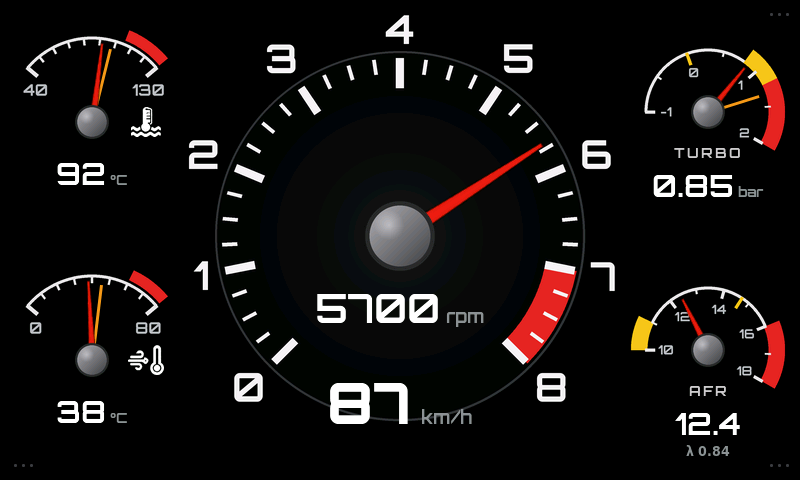

## What is on the screen

A classic analogue cluster built around one big rev counter. Numbers and
icons are white by day and amber in night mode; limits turn them red. Every gauge has
a needle **and** a digital readout, except speed, which is text only.

| Where | Gauge | Scale | Readout |
| --- | --- | --- | --- |
| centre | rev counter, 500 px | 0-8 x1000, red from 7000 | rpm, to 10, under the hub |
| bottom of the rev counter | speed | text only | km/h, 56 px Orbitron Black |
| left top | water temperature | 40-130 degC, red from 105 | degC, icon |
| left bottom | intake air temperature | 0-80 degC, red from 60 | degC, icon |
| right top | turbo | -1.0-2.0 bar, yellow 0.8-1.2, red from 1.2 | bar |
| right bottom | AFR | 10-18, yellow under 11, red over 16 | AFR and lambda |

**No warning lamps.** A value past its limit (settings menu) turns its own
readout red, the temperature icons go red with it. The only thing that
flashes is the shift light, see below. The one piece of text that can appear
is `NO CAN` (red) or `DEMO` (yellow) in the bottom left corner, and only while
the needles are not showing live data.

## OBD-II mode (VW T5.1 CAAC and other OBD cars)

Settings menu, **ECU protocol: OBD-II**, SAVE & CLOSE. The dash then stops
listening for rusEFI and instead asks the car's engine ECU for values, like
any OBD scan tool, and shows a plain test screen instead of the selected look:

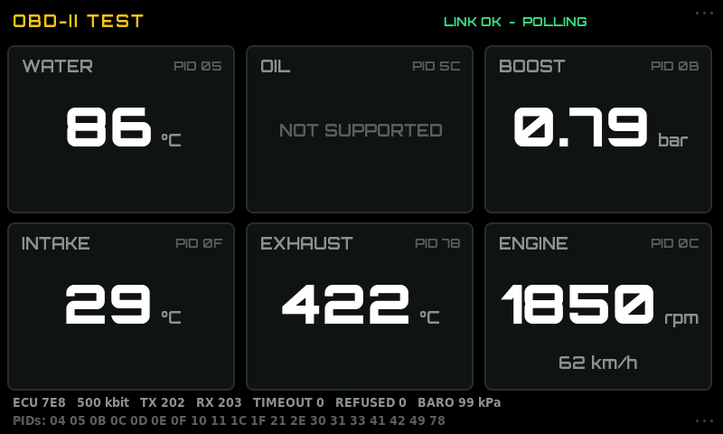

| Block | OBD-II PID | Notes |
| --- | --- | --- |
| WATER | 05 | |
| OIL | 5C, else VW UDS 22 11BE | the T5.1 has no 5C: its oil temperature comes as a VW measuring value |
| BOOST | 87, else 0B, minus baro 33 | 0B stops at 255 kPa absolute, 87 does not |
| INTAKE | 0F | |
| EXHAUST | 78, else VW UDS 22 10FB | 78: hottest bank 1 sensor, a two-frame ISO-TP answer; T5.1: EGT sensor 1 |
| ENGINE | 0C, 0D | rpm and speed: the quickest proof the data is live |

Top line: SCANNING PIDs, LINK OK - POLLING, NO ECU ANSWER (retried every
2 s) or DEMO DATA. Bottom lines: the ECU ID that answers (7E8 is the engine),
request / answer / timeout / refused counters, barometric pressure, and every
PID the ECU says it supports. That list is the thing to send when a block
stays empty.

How it talks: 500 kbit, 11-bit IDs, first a functional scan on 0x7DF (01 00,
01 20, ... which PIDs exist), then one request at a time straight to the
engine (0x7E0 -> 0x7E8), round robin over the supported PIDs the dash wants,
about 20 answers a second. The protocol lives in `main/obd2.c`; `tools/sim`
runs it against a fake T5-like ECU (`python tools/preview.py proto=1`).

### Wiring on the VW (OBD port under the dash)

| OBD pin | To |
| --- | --- |
| 6 | CAN H |
| 14 | CAN L |
| 4 or 5 | ground |
| 16 | permanent +12 V; the dash then stays on with the ignition off, so use a switched 12 V for the 5 V buck if it lives in the car |

**Keep the 120R jumper on the display.** On the owner's T5.1 nothing
answered without it: the diagnostic branch behind the gateway is only
terminated at one end.

First result on the T5.1 CAAC (EDC17, ECU 7E8): supported PIDs 01 04 05 0B
0C 0D 0F 10 11 13 1C 21 23 24 4F. Water, intake, boost (0B, no baro 33, so
101.3 kPa is assumed) and rpm / speed work; oil (5C) and EGT (78) are not
offered over OBD-II. SNIFF next to VCDS found them as VW measuring values on
the engine ECU, UDS service 22, both unsigned 16 bit in 0.1 K:

| VCDS | DID | log sample |
| --- | --- | --- |
| IDE00196 Engine oil temperature | 11BE | 0x0BC6 = 3014 -> 28.2 degC (VCDS 28.3) |
| IDE02229 Exhaust gas temperature sensor 1 | 10FB | 0x0FE1 = 4065 -> 133.4 degC, rising at idle |

The particulate filter, found the same way (VCDS 01, Advanced Measuring
Values), polled every 4th round since it moves slowly:

| VCDS | DID | scaling | log sample |
| --- | --- | --- | --- |
| IDE00427 DPF differential pressure | 14F5 | signed 16 bit, 1 hPa | 0x0005 -> 5 hPa (VCDS 5) |
| IDE00434 soot mass, calculated | 114F | signed 16 bit, 0.01 g | 0x04CC -> 12.28 g (VCDS 12.30) |
| IDE00435 soot mass, measured | 114E | signed 16 bit, 0.01 g | 0xFEB4 -> -3.32 g (VCDS -3.32) |
| IDE00436 distance since regeneration | 1156 | unsigned 32 bit, 1 m | 0x00043023 -> 274.467 km (VCDS 274467 m) |
| IDE04653 simulated DPF surface temperature | 1044 | 16 bit, 0.1 K | 0x0E34 -> 90.5 degC (VCDS 91.5, a little later) |

Once they answer, the bottom line of the test screen shows them instead of
the PID list, and the second page of the OBD-II screen (swipe left / right,
or tap the TEST / DPF tabs at the top) shows them properly:

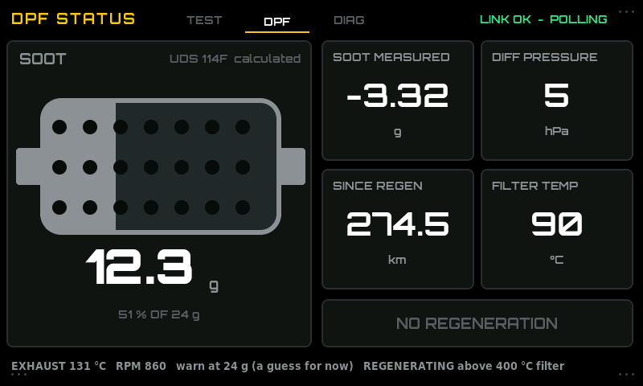

- A particulate filter drawing that fills up from the inlet side with the
  calculated soot mass (full width at 40 g). Grey while clean, amber from
  70 % of the warn level, red over it (24 g: a guess until a regeneration
  shows where this ECU starts one; `SOOT_WARN` in `ui_theme_obd.c`).
- Tiles: measured soot, differential pressure, distance since regeneration,
  filter temperature.
- **Regenerating** (filter hotter than 400 degC): the whole filter glows
  orange and the bar below it says so.

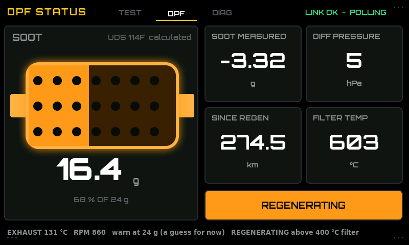

The dash polls them in the same round robin as the PIDs whenever the PID is
missing; the tile then says `UDS 11BE` / `UDS 10FB` instead of the PID. An
ECU that refuses a DID (7F 22) or ignores it three times in a row gets the
block marked NOT SUPPORTED.

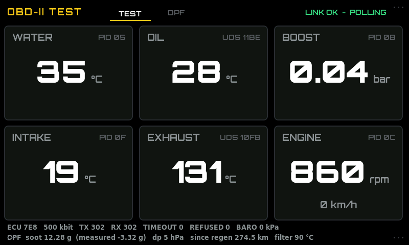

### Trouble codes (DIAG page)

The third page (swipe, or the DIAG tab) reads and clears the trouble codes,
like a generic OBD scanner:

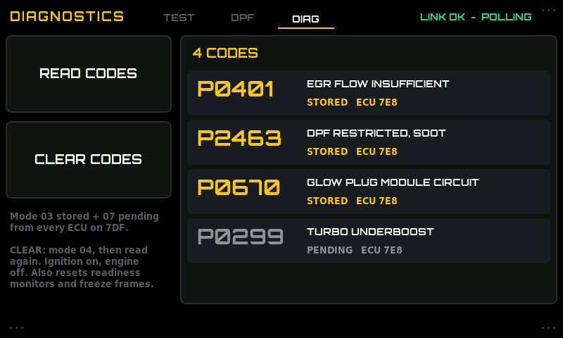

- **READ CODES**: mode 03 (stored codes) and mode 07 (pending: seen once,
  not confirmed yet) to 0x7DF, so every ECU that speaks OBD answers (engine
  7E8, gearbox 7E9, ...). Polling pauses for about a second meanwhile.
  Stored codes are yellow, pending ones grey, with the generic meaning
  (`main/dtc_text.c`, the common diesel ones; anything else gets its group,
  and the maker's own codes P1xxx / P3xxx say "see VCDS").
- **CLEAR CODES**: tap twice (the button turns red for 4 s after the first
  tap). Mode 04 to 0x7DF, then the codes are read again, so what comes back
  at once shows. Ignition on, engine off: an ECU with the engine running
  refuses (7F 04 22) and the page says so. Like any OBD tester this also
  resets the readiness monitors and the freeze frames.

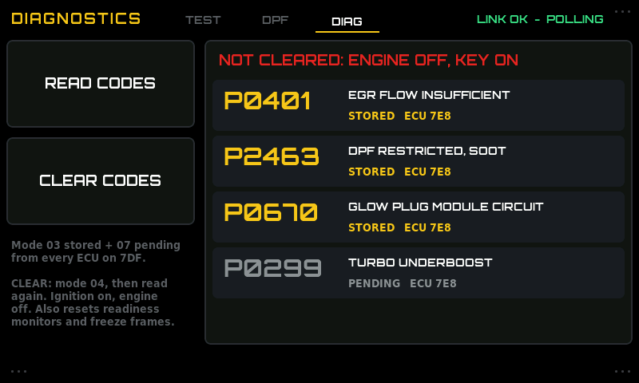

Tested on the T5.1 CAAC: with the air mass meter unplugged the code came up,
and CLEAR CODES (engine off, ignition on) cleared it.

Only what OBD offers: generic codes from the emission related ECUs. VW's
own fault memory of every module (airbag, ABS, cluster, ...) needs VCDS.

## SNIFF mode (finding the VW measuring values)

Settings menu, **ECU protocol: SNIFF**. The CAN controller goes listen-only
(no ACK, no error frames, nothing sent), and the dash listens
while VCDS reads the car through the same OBD port (a Y splitter, or the
dash's CAN H / L spliced onto pins 6 / 14 behind the socket).

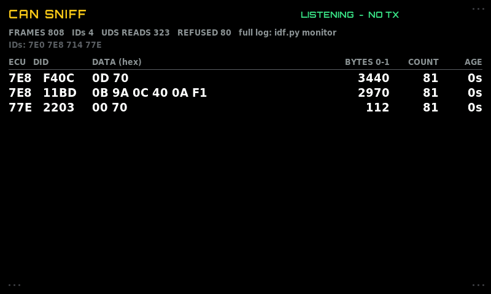

- Every frame goes to the serial console as `SNF <seconds> <id> <len>
  <bytes>`: run `idf.py -p COM4 monitor` on a laptop and save the output.
- The screen collects every UDS read answer (0x62) by ECU and DID, with the
  data bytes, the first two as a number, a count and the age. In VCDS open
  the engine (01) or the cluster (17), Advanced Measuring Values, pick oil
  temperature or an exhaust gas temperature: the row that changes when that
  value changes is its DID.
- The top lines list every CAN ID seen. 7E0/7E8 or 714/77E pairs mean UDS
  on ISO-TP; IDs around 0x200 and 0x300 mean the ECU still speaks KWP2000 on
  VW TP2.0, which the table does not decode but the console log keeps.

`main/sniff.c` has no ESP-IDF in it; `python tools/preview.py proto=2` feeds
it fake VCDS traffic.

## Looks

Settings menu, **Look**: NOTSTOCK (the default, described above), EMO,
LONK or HILL. The choice is saved and applied on SAVE & CLOSE.

| NOTSTOCK | EMO |
| --- | --- |
|  | 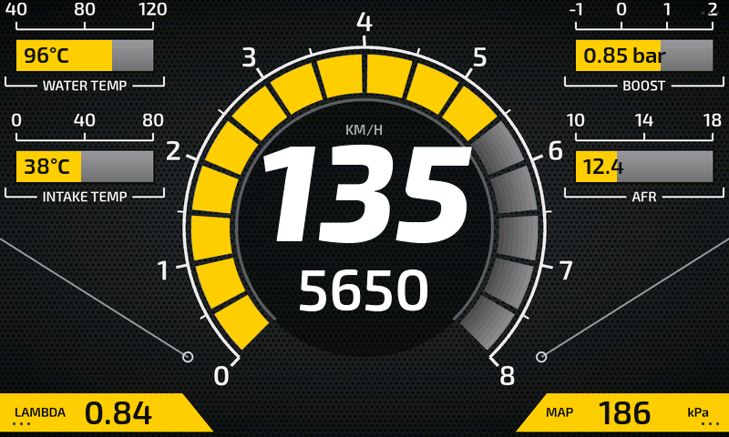 |
| **LONK** | **HILL** |
| 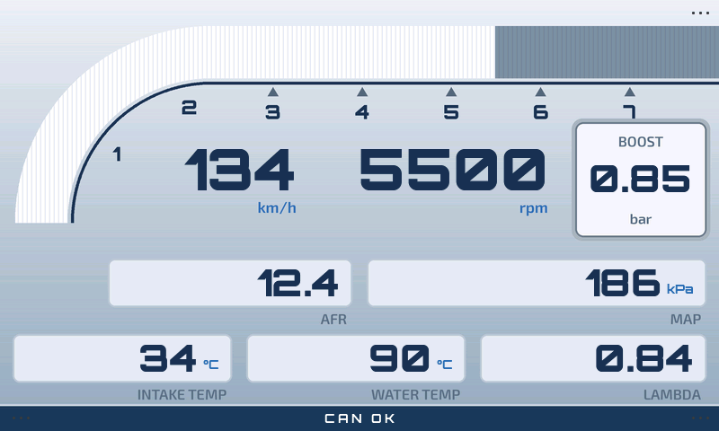 | 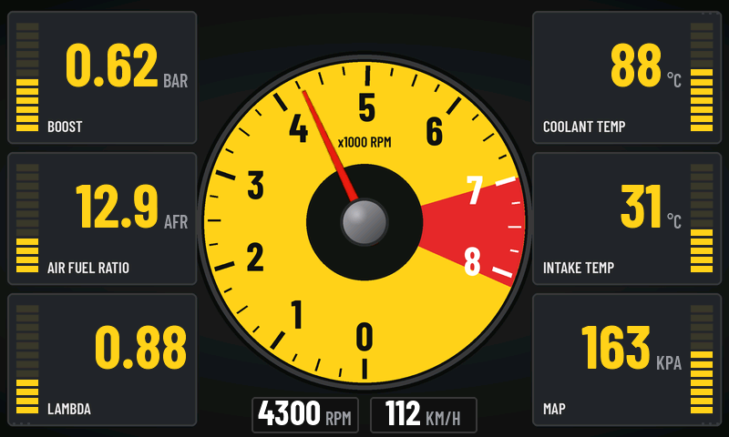 |

EMO, LONK and HILL are our own drawings in the spirit of well-known
aftermarket dashes. They show only what this dash reads from rusEFI, so gear,
oil, fuel, clock and warning lamps of the originals are left out, and no logos
are copied.

| Look | Middle | Around it |
| --- | --- | --- |
| EMO | segmented rev arc (red from 7000), big italic speed, rpm | bars: water, intake, boost, AFR; tabs: lambda, MAP |
| LONK | rev band along the top, speed, rpm, boost box | tiles: AFR, MAP, intake, water, lambda; info line shows CAN / NO CAN / DEMO |
| HILL | yellow round rev counter with needle, rpm and speed boxes | tiles with bargraphs: boost, AFR, lambda / water, intake, MAP |

Common to every look: the three long-press corners (menu, night mode, LOG),
the shift flash (the rev counter disc is the dial on EMO and HILL; LONK has no
round dial and always flashes the whole screen), limits turning values red,
NO CAN / DEMO, the LOG recording. Peak hold needles and the amber night ink
are NOTSTOCK only; night mode dims every look.

Only the selected look is built. Switching deletes the old screen and builds
the new one, so the LVGL heap holds one look, the menu and the LOG. The boot
log states the headroom:

```
LVGL heap 41% used, 47880 B free; internal RAM 58312 B free
```

Each look is `main/ui_theme_<name>.c` plus one baked background from
`tools/gen_themes.py` (layout numbers at the top of the script, exported to
`main/theme_art.h`). The fonts (Exo 2 for EMO, Orbitron for LONK, Barlow
Condensed for HILL, all SIL OFL) come from `tools/gen_fonts.sh`.

```bash
python tools/gen_themes.py
python tools/preview.py look=1 rpm=5650 speed=135   # EMO; 2 LONK, 3 HILL
```

## Changing the look

Two layers, each with one place to edit:

**The artwork**: `tools/gen_dials.py`. Scales, tick spacing, zones, colours,
needle and hub sizes are constants at the top. It draws everything in Pillow
at 4x supersampling and writes

- `main/dials.c`, RGB565 / RGBA image data,
- `main/dials.h`, the matching geometry: sweep angles, ranges, redline,
  needle pivots,
- `build_art/*.png`, the same images for a quick look.

`ui.c` takes every range and angle from `dials.h`, so a changed scale cannot
drift out of step with the needle.

**Fonts**: every number and label on the dash is
[Orbitron](https://fonts.google.com/specimen/Orbitron) (SIL OFL,
`assets/fonts/`). `tools/gen_fonts.sh` turns it into the `main/fonts/dash_orb_*.c`
and `dash_speed_56.c` files with `lv_font_conv` (`npm i -g lv_font_conv`);
`gen_dials.py` draws the scale numbers with the same TTF. Units sit on the
same baseline as their number (`unit_on_baseline` in `ui.c`). The settings
menu and the lambda line use DejaVu Sans Condensed Bold, whose font files
carry their own `lv_font_conv` line.

**Look**: the rev counter has a dark gradient face under its ticks with a
thin grey rim, numbers outside on black. The side gauges are 184 px wide and
carry minor ticks; boost and AFR have their numbers inside the arc and a
yellow mark at 0 bar and at 14.7.

**Icons**: `tools/gen_assets.py` traces the water and intake icons out of
`assets/icons_sheet.png` into `main/icons.c`. Replace the source file and
re-run it; `ui.c` places icons by their centre, so a different size needs no
layout edit.

**Boot logo**: `assets/splash.png`, the round NOT STOCK. / NOT STABLE. badge.
`tools/gen_splash.py` keys out its white background (on the blue channel, so
the rim stays smooth), crops it to the disc and writes `main/splash.c` at
440x440. At power-up the screen starts black, the logo rises out of it over
`BOOT_IN_MS` (0.8 s), holds for `BOOT_HOLD_MS` (1.2 s) and crossfades into
the dash over `BOOT_FADE_MS` (0.7 s), all in `main/boot_anim.h`.

The animation does not go through LVGL. Blending the logo, and then the whole
screen, through LVGL's 40-line draw buffer stuttered on the panel.
`main/boot_anim.c` writes the frames straight into the RGB panel's frame
buffer with a 32-level integer RGB565 blend. During the hold LVGL runs
normally but renders into a shadow buffer in PSRAM (`s_shadow` in `main.c`),
so the needles settle on live values and the crossfade ends on exactly the
frame LVGL thinks is on screen. Preview any moment of it with
`python tools/preview.py boot=500` (milliseconds after power-up).

**The layout**: the `LY_*` block at the top of `main/ui.c`. Every gauge is
placed by its pivot, readouts by an offset from that pivot. Colours are the
`C_*` defines, needle lag is `NEEDLE_SMOOTH`.

```bash
python tools/gen_dials.py     # after changing the artwork
python tools/preview.py       # renders preview/*.png
idf.py build flash
```

### Previewing on the PC

`tools/preview.py` compiles the real `ui.c`, `ui_menu.c`, `settings.c`, fonts
and artwork together with LVGL for the PC (`tools/sim/`) and renders frames
into `preview/`. Nothing in it re-implements the layout, so the PNG is what
the panel shows, pixel for pixel. Standard scenes: normal driving, everything
past its limit, idle, no CAN, settings menu. For one custom frame:

```bash
python tools/preview.py rpm=6500 speed=140 clt=96 iat=41 boost=1.35 afr=11.8
python tools/preview.py link=0          # NO CAN
python tools/preview.py demo=1 t=3.2    # demo generator at 3.2 s
```

Needs `make`, a C compiler and Pillow. LVGL is taken from
`managed_components/` after one `idf.py build`, or from `LVGL_DIR`.

### Why the artwork is pre-rendered

The scales never change, so they are not rebuilt from LVGL primitives every
frame. A blit is cheaper than dozens of line and arc draws and looks far
better: LVGL 8 cannot antialias hairline ticks or hint small labels. At
runtime LVGL only rotates the needle images and rewrites the numbers.

Each face is a plain image centred on its pivot, with a transparent
`lv_meter` on top that only draws the needle. The meter is not given the face
as its background because `lv_meter` puts its centre at (w/2, w/2) from the
top-left, which only works for square images, and the side gauges are not
square.

The rev counter scale and redline are baked in. Change `RPM_MAX` /
`RPM_REDLINE` in `gen_dials.py` and re-run it; there is no menu setting for
them any more.

## Which board

This copy is built for the **Waveshare ESP32-S3-Touch-LCD-7** (800x480, N8R8).
It is a port of the working 5 inch build. The layout, CAN decoding and menu are
identical; only the board support changed. Both boards are handled by
`DASH_BOARD` in `main/board.h`, here set to `BOARD_WS_LCD7`.

| | this project (7 inch) | 5 inch |
| --- | --- | --- |
| `DASH_BOARD` | `BOARD_WS_LCD7` | `BOARD_WS_LCD5` |
| CAN TX / RX | GPIO20 / GPIO19 | GPIO15 / GPIO16 |
| CAN pins shared with USB OTG | yes, EXIO5 selects | no, dedicated |
| EXIO5 | CAN/USB selector, driven high | DI1, an isolated input |
| Module | N8R8, 8 MB flash | N16R8, 16 MB flash |
| Console | UART0 via CH343 ("UART" Type-C) | USB Serial/JTAG |

The RGB data and sync pins are identical on both, which is why a picture
appears either way. Flashing the wrong build gives a working picture but dead
CAN.

## Build

Needs ESP-IDF 5.1 or newer.

```bash
idf.py set-target esp32s3
idf.py build
idf.py -p COMx flash monitor
```

LVGL 8.4 is pulled automatically by the component manager and configured
entirely through `sdkconfig.defaults`, so there is no `lv_conf.h` to babysit.

If you built the 5 inch project in the same folder before, run
`idf.py fullclean` and delete `sdkconfig` first, otherwise the old 16 MB /
USB-console values survive in it and `sdkconfig.defaults` is ignored.

### Two Type-C ports, use the UART one

The 7 inch has two Type-C ports:

- **UART**: CH343 USB-UART bridge on GPIO43/44. Flash and `idf.py monitor`
  go through this one. It shows up as a CH343 COM port (Windows may need the
  WCH driver).
- **USB**: the ESP32-S3 native USB on GPIO19/20. **Dead while the dash runs.**
  GPIO19/20 are also the CAN pins, and the firmware drives EXIO5 on the
  CH422G high at boot, which switches them from USB to the CAN transceiver.

`sdkconfig.defaults` therefore keeps the log console on UART0.

### Flash size and partitions

`sdkconfig.defaults` is set to 8 MB to match the N8R8 module. The stock
`SINGLE_APP_LARGE` table caps the app at 1.5 MB, which the baked dial artwork
gets close to, so `partitions.csv` gives the app almost all of the 8 MB
(nvs, phy_init, one 7.9 MB factory app).

## Settings menu

**Long-press the bottom-right corner of the screen** for about half a second.
The hit area is invisible apart from three dim dots; nothing about normal
driving opens it. Values apply live as you adjust them, SAVE & CLOSE writes
them to NVS so they survive a power cut, DEFAULTS puts everything back.

The build stamp sits bottom right of that screen: `NOT STOCK v3.1` over the
compile date, the LVGL version and the IDF version. `DASH_VERSION` in
`main/ui_menu.h` is the bit to bump.

| Setting | Range | Notes |
| --- | --- | --- |
| Shift flash | on/off | master switch for the shift flash |
| Shift flash at | 0-9000 rpm | 0 disables it |
| Shift flash level | 10-100 % | peak opacity of the wash |
| Shift flash area | Screen / Rev counter | whole screen, or the rev counter face inside its rim (numbers stay clear) |
| Shift flash colour | Red / White / Blue / Amber | |
| Shift flash period | 80-600 ms | one on + off cycle, default 200 ms (5 Hz) |
| Water temp | 60-130 degC | readout red at or above |
| Intake air temp | 20-120 degC | readout red at or above |
| Boost limit | 0-2.5 bar | readout red at or above, 0 disables |
| AFR lean limit | 0-20.0 | readout red at or above, 0 disables |
| Brightness | 15-100 % | see the note below |
| Night mode | on/off | also a long press on the bottom left corner |
| Night dim | 20-80 % | how dark night mode is |
| Fuel | Petrol / E85 | sets stoichiometric AFR, 14.7 or 9.8 |
| Baro offset | 0.80-1.10 bar | what gets subtracted from MAP for boost |
| Demo mode | on/off | synthetic data, no reflash needed |

The rev counter readout goes red at the baked redline.

Settings are stored with a version number. This build changed the stored
layout, so the first boot after flashing it starts from the defaults.

**Brightness is software, not backlight.** EXIO2 on the CH422G is a plain
display-enable line with no PWM, so there is no way to dim the LEDs from
firmware. The setting lays a black wash over the picture instead, which lowers
apparent brightness but not power draw or black level. That is why it stops at
15 %.

## Shift flash

**Revs are the only thing that flashes the screen.** Every other limit turns
its own readout red and leaves it at that. Temperatures and pressures creep,
and strobing the panel while the driver is trying to read the number that
caused it is worse than useless. Revs are the one case where the reaction has
to happen inside a second, with your eyes on the road.

Above the set rpm the screen, or just a disc over the rev counter, pulses in
the chosen colour and period (menu). It only runs while the dash is on screen,
so demo mode does not strobe the settings menu. It is a square wave rather
than a fade, because a hard flash is far more noticeable in
daylight and costs one opacity write per half period rather than one per
frame. The wash sits on LVGL's top layer, so it covers the dash but does not
block the menu, and the brightness dim sits above it on the system layer so a
dimmed screen also has a dimmer flash.

## Night mode

**Long-press the bottom left corner** (three dim dots, like the menu corner)
to toggle it; it is saved straight away. By day every number and icon on the
dash is white. At night they turn amber and a warm dark wash, `Night dim`
strong, takes the white artwork down to a warm grey. Brightness and night
share one wash on the system layer, opacities combined, so there is never a
second full-screen blend.

## LOG screen

**Long-press the top right corner** of the dash (three dim dots) to open it,
**DASH** in the same corner goes back.

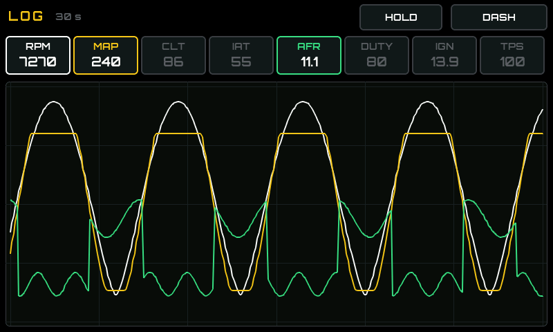

The last 30 s of up to eight channels as a live chart, 10 samples a second:

| Button | Channel | Chart range | From |
| --- | --- | --- | --- |
| RPM | engine speed | 0-8000 | base+1 |
| MAP | manifold pressure, kPa | 0-300 | base+3 |
| CLT | coolant, degC | 0-130 | base+3 |
| IAT | intake air, degC | 0-80 | base+3 |
| AFR | air/fuel ratio | 10-20 | base+7 (lambda x stoich) |
| DUTY | injector duty, % | 0-100 | base+1 |
| IGN | ignition timing, deg | -10-50 | base+1 |
| TPS | throttle, % | 0-100 | base+2 |

Each button shows the live value and switches its line on or off; the choice
is saved. Every line is scaled to its own range, so they all use the full
height and the vertical position is only meaningful per channel; read the
numbers off the buttons. Grid lines are 5 s apart, newest on the right.

**Recording never stops**, whichever screen is up. When something odd happens
on the road, open the log afterwards and the last 30 s are there. The history
lives in RAM and is gone after a power cycle.

**HOLD** freezes the chart and puts a yellow cursor line on the newest point.
**Tap or drag on the chart** to move it: the buttons then show every
channel's value at that moment, and the top line how long ago it was
(`HELD -10.9 s`). Everything on screen reads the same frozen snapshot while
recording carries on underneath. **LIVE** goes back to the running chart.

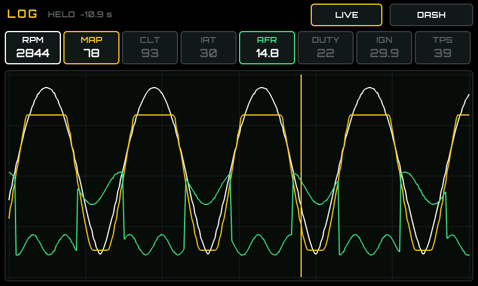

Channels and ranges are the `CH[]` table at the top of `main/ui_log.c`;
anything else rusEFI broadcasts (`dash_data_t` in `rusefi_can.h`) can be
added there.

## Peak hold

Water, intake air and boost each have a thin amber drag needle that stays at
the highest value since power-up. Revs and AFR have none, they swing too
much for a peak to mean anything. **Long-press any of the three gauges** to
clear all peaks. Peaks are not saved; a power cycle clears them too.

## Bench test without the car

Turn on Demo mode in the settings menu. A synthetic generator sweeps every
gauge and the top line reads DEMO. No rebuild, no reflash.

## Touch

GT911 on the shared I2C bus, address 0x5D, INT on GPIO4, reset on CH422G EXIO1.

**Coordinates are scaled, not clipped.** This board ships in 800x480 and
1024x600 flavours and the touch controller carries its own configuration, so it
can report on a different grid than the panel actually has. The driver reads
the controller's configured X and Y maxima at boot and scales every point onto
the panel. An earlier version discarded anything at or beyond 800x480, which on
a 1024x600 controller silently threw away the entire right and bottom of the
screen, including the corner the settings menu lives in.

The boot log states both grids:

```
GT911 at 0x5D, id 911, controller grid 1024x600, panel 800x480  -> scaling
```

and every press logs one line, `touch 743,451`. If presses appear in the log
but land in the wrong place, the scaling numbers in that boot line are the
thing to look at. If nothing appears at all, check the i2c scan line for 0x5D.
The INT line doubles as the address select during reset. The reset follows
Waveshare's own ESP-IDF demo for this board: reset low 100 ms, INT low 100 ms,
reset high, 200 ms settle, and INT stays driven low because touch is polled.
Releasing INT early left the controller answering on I2C but never scanning
(`no touch yet: ... raw 0x00` forever). If the controller
does not answer on 0x5D it retries 0x14. A failed probe is not fatal: the dash
runs as before, only the menu becomes unreachable.

## Wiring

| Board | To |
| --- | --- |
| CAN terminal H / L | rusEFI CAN H / L, twisted pair |
| CAN 120R | the 7 inch has a termination jumper. Leave it fitted if the dash is the far end of the bus, remove it otherwise |
| 5V | 12V to 5V buck, 1A minimum, switched with ignition |

Draw is roughly 450 mA at 5V with the backlight up.

## rusEFI side (TunerStudio, CAN bus settings)

- Enable rusEFI verbose CAN: **on**
- rusEFI CAN data base address: **512** (0x200)
- ID width: **11 bit**
- Bitrate: **500 kbit** (match `CAN_BITRATE_500` in `main/rusefi_can.h`)
- Can Dash Type: **None**

On uaEFI the CAN pair is on the main connector; see the
[uaEFI pinout](https://github.com/rusefi/rusefi/wiki/uaEFI).

The dash runs TWAI in normal mode, not listen-only, on purpose. On a two node
bus the dash has to acknowledge frames or rusEFI piles up transmit errors and
eventually drops to bus-off. It never queues a transmission of its own
(`tx_queue_len = 0`).

Decoded frames, from
[can_verbose.cpp](https://github.com/rusefi/rusefi/blob/master/firmware/controllers/can/can_verbose.cpp).
The decoder still reads everything it did before; the screen uses the rows
marked in bold.

| ID | Contents |
| --- | --- |
| base+0 | Status: fan / fan2, check engine, rev limit |
| base+1 | **RPM**, ignition timing, injector duty, **VSS** |
| base+2 | TPS |
| base+3 | **MAP** (boost = MAP - baro), **coolant**, **intake air temp** |
| base+4 | oil pressure, oil temp, battery voltage |
| base+7 | **lambda** (AFR = lambda x stoich), low-side fuel pressure |

Scaling constants (`PACK_MULT_PRESSURE` 30, `PACK_MULT_LAMBDA` 10000,
`PACK_ADD_TEMPERATURE` 40, `PACK_MULT_VOLTAGE` 1000, `PACK_MULT_ANGLE` 50) come
from [rusefi_generated.h](https://rusefi.com/docs/html/rusefi__generated__cypress_8h_source.html).

VSS is a uint8 in km/h, so speed tops out at 255.

## Expected frame rate

Waveshare's own measurement on this board with ESP-IDF 5.3 is
[26 fps average for the LVGL benchmark at PCLK 21 MHz](https://www.waveshare.com/wiki/ESP32-S3-Touch-LCD-7).
That number is for full-screen churn. This dash redraws only dirty rectangles
and caches every label so nothing is invalidated unless its text actually
changed. The UI refresh timer is 40 ms.

`sdkconfig.defaults` already carries the performance flags Waveshare
recommends: 240 MHz, QIO flash, octal PSRAM, instructions and rodata fetched
from PSRAM, 64 byte cache lines, `-O2`, LVGL hot paths in IRAM.

## If something is wrong

The board support is what already ran on the 7 inch; the gauges are new and
have only been checked in the simulator, not on the panel. In rough order of
likelihood:

1. **Screen stays black.** The CH422G IO expander is the suspect. This
   firmware writes mode byte 0x01 to I2C address 0x24 and then the output
   bitmap to 0x38, with backlight on EXIO2, LCD reset on EXIO3. Compare
   against `ESP_IOExpander_CH422G` in Waveshare's own demo if it misbehaves.
2. **Image drifts sideways or tears.** Raise `bounce_buffer_size_px` in
   `panel_init`, or drop `LCD_PCLK_HZ` to 16 MHz.
3. **Panel geometry off.** The porch values in `panel_init` are Waveshare's;
   ST7262 panels tolerate a wide range but a shifted image means these.
4. **Nothing on CAN.** Watch the serial log for TWAI bus-off warnings, and
   check the 120R termination jumper. The boot log states which pins TWAI came
   up on: it must say `tx 20 rx 19`. If it says `tx 15 rx 16` you are running
   the 5 inch build.

5. **Needles stutter.** Each needle redraws its rotated bounding box every
   40 ms. Raise the UI timer period in `ui_create` or lower `NEEDLE_SMOOTH`
   so fewer frames carry movement.

## Sources

- [Waveshare ESP32-S3-Touch-LCD-7 wiki](https://www.waveshare.com/wiki/ESP32-S3-Touch-LCD-7) - pin map, CH422G, performance notes
- [ESP-IDF RGB LCD driver](https://docs.espressif.com/projects/esp-idf/en/release-v5.3/esp32s3/api-reference/peripherals/lcd/rgb_lcd.html)
- [LVGL 8.4 docs](https://docs.lvgl.io/8.4/)
- [rusEFI can_verbose.cpp](https://github.com/rusefi/rusefi/blob/master/firmware/controllers/can/can_verbose.cpp)
