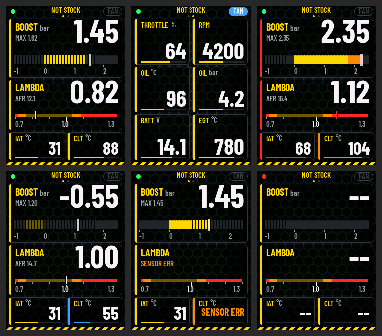

# NOT STOCK 2" gauge, ECUMaster EMU Black

Waveshare **RP2350-Touch-LCD-2** (RP2350, 2" IPS 320 x 240 landscape, ST7789T3 on
SPI, CST816D touch, QMI8658) reading an **ECUMaster EMU Black** over its
CAN stream, as [`../notstock-round-emu`](../notstock-round-emu) does on the
2.1" round board: the same decoder (`../notstock-round-emu/main/emu_stream.c`),
the same honeycomb, NOT STOCK yellow.



Page 1, page 2 (fan running), alarm, vacuum, failed sensors, no data.

**State: built; the pages checked in the simulator. Not tried on the
board yet.**

## The pages

Swipe left / right. At the top: the link dot (green: stream frames
coming, red: none), NOT STOCK with the page dots, FAN lit blue while the
EMU runs the coolant fan (OUTFLAGS4 bit 1). Every channel is a card whose
left edge is yellow, orange (warn), red (alarm, the value blinks) or blue
(cold).

- **Page 1**: BOOST (MAP - BARO, an LED bar of 0.1 bar segments from -1
  to 2.5, the vacuum dim, the white cap is the MAX since power-on),
  LAMBDA (a needle on 0.70 .. 1.30, the zones are the alarm limits, AFR
  under the title), IAT, CLT.
- **Page 2**: throttle, RPM, oil temperature, oil pressure (no alarm
  under 400 rpm), battery, EGT1.

| Channel | Orange | Red |
| --- | --- | --- |
| BOOST | from 1.8 bar | from 2.2 |
| LAMBDA | under 0.762, over 1.034 | under 0.714, over 1.088 |
| IAT | over 50 | from 65 |
| CLT | over 100; blue under 60 | from 108 |
| RPM | from 6500 | from 7200 |
| OIL degC | over 120; blue under 60 | from 135 |
| OIL bar | under 1.0 | under 0.5 |
| BATT | under 12.0, over 14.8 | under 11.5, over 15.2 |
| EGT | from 900 | from 950 |

Limits and ranges: `CH[]` in `main/ui_l2.c`. A failed sensor (the EMU's
error flags) shows SENSOR ERR, a frame older than 1 s `--`. The
background: `tools/gen_bg.py` -> `main/l2_bg.c`.

## Simulator

```
make -C tools/sim LVGL_DIR=/path/to/lvgl-8.4
tools/sim/build/sim out.ppm boost=1.45 lambda=0.82 page=0
```

Inputs: see `tools/sim/sim.c`.

## Board

Pins from Waveshare's schematic and demo code (`main/hw_l2.h`):

| What | GPIO |
| --- | --- |
| LCD SPI0: SCK, MOSI, CS, DC, RST | 18, 19, 17, 16, 20 |
| Backlight (PWM) | 15 |
| I2C0 SDA, SCL: touch CST816D 0x15, IMU QMI8658 0x6B | 12, 13 |
| Touch INT, IMU INT1 | 29, 14 |
| Battery ADC | 28 |
| SD card (SPI) | 24 .. 27 |
| Camera | 0 .. 11, 22, 23 |

The panel runs landscape as Waveshare's demo (`HORIZONTAL`); the other
way round: build with `-DL2_FLIP=1`. 16 MB flash, no PSRAM: LVGL draws
into two 40-line buffers (512 kB SRAM, 123 kB used).

## CAN

The RP2350 has no CAN controller: [can2040](https://github.com/KevinOConnor/can2040)
(`third_party/can2040`, GNU GPLv3) is one in software on PIO0. It
acknowledges the frames it receives, as the EMU needs (see
[`../notstock-round-emu`](../notstock-round-emu/README.md#can)), and
never sends one of its own. Its interrupt code, the callback and the
stream decoder are linked into RAM (`CMakeLists.txt`), so flash reads
from the drawing never hold the interrupt up.

The bit rate is the EMU's: tried 500 k, 1 M, 250 k, 125 k, 0.4 s each,
until stream frames come; gone for 3 s: again. The log (USB serial) says
`can: trying N kbit`, then `can: EMU stream at N kbit`.

Wiring, SN65HVD230 board to the board's header (the camera connector
stays empty: its pins are these):

| SN65HVD230 | Header pin | GPIO |
| --- | --- | --- |
| 3V3 | 1 (3V3) | |
| GND | 2 (GND) | |
| CTX | 7 | GPIO2 |
| CRX | 9 | GPIO3 |

CAN-H / CAN-L to the EMU's CAN bus, 120 R at both ends as on the round
gauge. Power: 5 V into the USB-C or header pin 15 (5V) from a 12 V -> 5 V
converter, never 12 V straight.

## Build and flash

```
cmake -S . -B build -G Ninja -DPICO_SDK_PATH=/path/to/pico-sdk-2.1.1 \
      -DLVGL_DIR=/path/to/lvgl-8.4
cmake --build build
```

`build/notstock_lcd2_emu.uf2`: hold BOOT, plug the USB-C in (or press
RST while holding BOOT), a drive RP2350 shows up, copy the .uf2 onto it;
the board restarts into the gauge.

Licence note: with can2040 linked in, the firmware as a whole falls under
the GPLv3 when given to anyone (source along with it).
