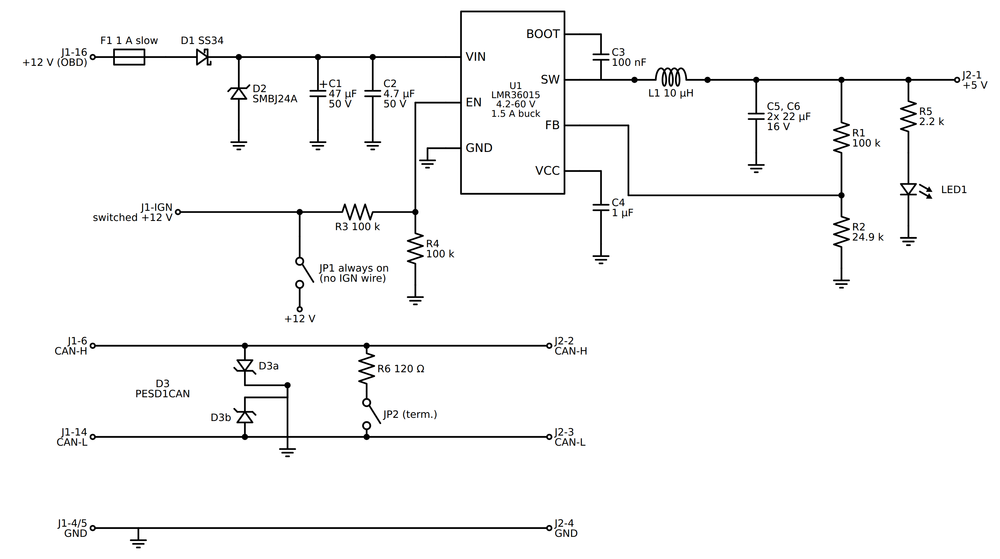

# NOT STOCK power + CAN board

A small board for one box behind the dash: the OBD cable comes in, the display
cable goes out. On the board are a fuse and protection on the car's +12 V, a
buck converter from 12 V to 5 V for the display, and CAN-H / CAN-L passed
straight through. There is no CAN chip here. The SN65HVD230 sits next to the
ESP32 in the display.

```
 OBD plug ── cable ──┐                 ┌── cable ── display (5 V, CAN-H, CAN-L, GND)
                     J1 ─ F1 ─ D1 ─ U1 buck ─ J2
                          CAN-H / CAN-L straight through, ESD, optional 120 R
```

**State: schematic only.** `docs/schematic.py` draws it (schemdraw). A KiCad
project and layout are the next step.



## Blocks

- **Input.** F1 1 A slow blow, then D1 (SS34 Schottky) against reverse
  polarity, then D2 (SMBJ24A TVS) against load dump and spikes. D2 starts
  conducting above about 26.7 V and clamps near 39 V, which is below the
  regulator's 60 V. If D2 ever conducts hard for long, F1 blows.
- **Buck.** U1 LMR36015 (TI, 4.2 to 60 V in, 1.5 A). Output 5.0 V set by R1 / R2:
  `Vout = 1.0 V x (1 + 100k / 24.9k) = 5.02 V`. The display with the ESP32-S3,
  BLE and backlight at full takes roughly 0.3 to 0.4 A at 5 V, so about 0.2 A
  from the 12 V side. 1.5 A leaves plenty of margin and the chip stays cold.
- **Ignition.** OBD pin 16 is permanent +12 V, so the display would stay on
  with the key out and slowly drain the battery. Two options:
  - an IGN wire (switched +12 V, e.g. from the fuse box) to J1-IGN. R3 / R4
    halve it onto EN; the buck starts at about 2.5 V on IGN and switches off
    with the key. With the regulator off, the board takes microamps.
  - JP1 closed: EN tied to +12 V through R3, always on. Only for testing, or
    if the car switches pin 16 with the key.
  The round gauge is meant to need nothing but the OBD plug, so it runs
  with JP1 closed and switches itself off: when the CAN bus has been quiet
  for a while (car locked, the gateway asleep) the ESP32 turns the backlight
  off and goes into deep sleep, and the first CAN frame wakes it again (the
  SN65HVD230's receiver stays on, its RX line toggles a wake-up GPIO). The
  buck draws about 25 uA without load; what the display board itself draws
  asleep has to be measured once it is here, the target is well under
  1 mA.
- **CAN.** CAN-H (OBD 6) and CAN-L (OBD 14) go straight to J2. D3 PESD1CAN
  protects both lines against ESD at the connector. R6 120 Ω with JP2 is an
  optional termination. On the T5.1 on the bench a 120 Ω was needed for the
  display to talk, so JP2 is closed by default. On a car where the OBD bus is
  already terminated at both ends, open it.
- **LED1** with R5 2.2 k: 5 V present (about 1.5 mA).

## Connectors

J1 (to the OBD plug)

| Pin | Signal | OBD-II pin |
|---|---|---|
| 1 | +12 V permanent | 16 |
| 2 | GND | 4 and 5 |
| 3 | CAN-H | 6 |
| 4 | CAN-L | 14 |
| 5 | IGN, switched +12 V (optional) | none, own wire |

J2 (to the display)

| Pin | Signal |
|---|---|
| 1 | +5 V |
| 2 | CAN-H |
| 3 | CAN-L |
| 4 | GND |

The schematic labels J1 by the OBD pin numbers (J1-16, J1-6...) so the wiring
is obvious. Board connectors: JST XH 2.54 mm or a screw terminal for J1, JST
XH or a 4-pin aviation connector (GX12) for J2 if the cable has to come off
through the dash. Run CAN-H and CAN-L as a twisted pair all the way, in both
cables. A 4-core cable with one twisted pair, or two twisted pairs (one for
CAN, one for 5 V / GND), up to about 2 m is fine.

## Parts

| Ref | Value | Package | Example |
|---|---|---|---|
| F1 | 1 A slow blow | 1206 SMD or 5x20 holder | Littelfuse 0466001 / Bourns SF-1206S100 |
| D1 | Schottky 40 V 3 A | SMA / SMB | SS34 |
| D2 | TVS 24 V unidirectional | SMB | SMBJ24A |
| C1 | 47 µF 50 V electrolytic | 6.3x7.7 SMD | Panasonic EEE-FK1H470P |
| C2 | 4.7 µF 50 V X7R | 1206 | |
| U1 | LMR36015, 5 V adjustable | VQFN-HR 12 (2 x 3 mm) | LMR36015ARNXR (check suffix: 400 kHz / 2.1 MHz, FPWM or PFM) |
| L1 | 10 µH, ≥ 2.5 A sat, < 60 mΩ | 5 x 5 mm shielded | Würth 74438357100, Bourns SRN5040-100M |
| C3 | 100 nF 16 V X7R | 0603 | |
| C4 | 1 µF 16 V X7R | 0603 | |
| C5, C6 | 22 µF 16 V X7R | 1206 | |
| R1 | 100 k 1 % | 0603 | |
| R2 | 24.9 k 1 % | 0603 | |
| R3, R4 | 100 k | 0603 | |
| R5 | 2.2 k | 0603 | |
| LED1 | green | 0603 | |
| D3 | CAN bus ESD | SOT-23 | Nexperia PESD1CAN or PESD2CAN |
| R6 | 120 Ω, 0.25 W | 1206 | |
| JP1, JP2 | solder jumper or 2-pin header + jumper | | |
| J1 | 5 pin | 2.54 / 3.5 mm | JST XH or screw terminal |
| J2 | 4 pin | 2.54 mm | JST XH or GX12-4 |

The LMR36015 is a small QFN with a thermal pad: it wants a stencil and a hot
air station or reflow, or a board assembled by the PCB house (JLCPCB / PCBWay
carry it). **Check the pinout and the exact variant against the TI datasheet
before layout.** The drawing shows the functional pins; the chip has two VIN
and two PGND pins, plus PG and a mode / sync pin, which in this design are:
PG unconnected, mode per the datasheet for automatic PFM at light load (lower
standby current).

If QFN is not an option, the same board works with a ready 5 V buck module
(e.g. Pololu D24V10F5 or D36V6F5, 36 V max) in place of U1, L1, C3 to C6 and
R1 / R2. Keep F1, D1, D2, C1 and the CAN part as drawn. With a 36 V module,
D2 must clamp below 36 V: use SMBJ18A there.

## Layout notes

- Size: about 40 x 25 mm, two layers, the bottom a solid ground plane.
- Keep the switching loop small: C2 right at VIN / PGND of U1, C5 / C6 right
  at the L1 output and back to the same ground. The SW node short and small,
  away from the CAN lines and from R1 / R2.
- FB: R1 / R2 close to the FB pin, the top of R1 taken from the output caps.
- The thermal pad of U1 to ground with 4 to 6 vias.
- D2 and C1 close to J1, before anything else. D3 close to J1 on the CAN
  lines, with a short fat path to ground.
- CAN-H / CAN-L as a pair from J1 to J2, same length, no vias if possible.
- F1 rated and routed for 1 A; 0.5 mm traces on the 12 V side are plenty.

## Files

- `docs/schematic.py`: draws `docs/schematic.svg` (needs `pip install
  schemdraw`). `docs/schematic.png` is the same rendered for GitHub.
