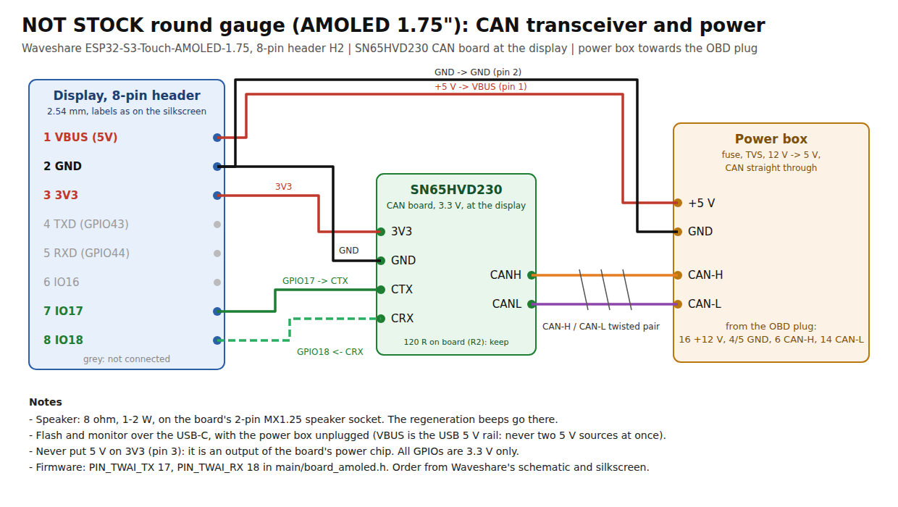

# NOT STOCK round gauge, AMOLED 1.75"

The round gauge of [`../notstock-round`](../notstock-round) on the Waveshare
**ESP32-S3-Touch-AMOLED-1.75** (466 x 466 AMOLED, CO5300 over QSPI, CST9217
touch, ES8311 codec with a speaker amplifier). Same UI, pages, looks, MULTI,
DPF status, diagnostics, settings and OBD/CAN code: this project builds the
sources of `../notstock-round/main` with the faces drawn for 466 x 466
(`main/faces466`) and its own board layer, `main/hw_amoled.c`.

Not yet run on the board: built, and the UI checked in the simulator at
466 x 466 (`make SIZE=466` in `../notstock-round/tools/sim`).

## Build and flash

ESP-IDF 5.x, from this folder:

```
idf.py set-target esp32s3
idf.py build flash monitor
```

The board's only USB-C is the ESP32-S3's own USB: flashing and the console
go there. If it does not show up as a port: hold BOOT, tap RESET (or plug
in), release BOOT.

The sources come from `../notstock-round/main` through a glob that CMake
reads once: after adding a source file there, `idf.py reconfigure`.

## Wiring



8-pin header (H2), in the order of its silkscreen: VBUS, GND, 3V3, TXD
(GPIO43), RXD (GPIO44), IO16, IO17, IO18. (Waveshare's hardware reference
numbers pins 4..8 differently from their own schematic and silkscreen; the
silkscreen labels are what counts.)

| Header (silkscreen) | To |
| --- | --- |
| VBUS | power box +5 V |
| GND | power box GND, SN65HVD230 GND |
| 3V3 | SN65HVD230 3V3 |
| IO17 | SN65HVD230 CTX (TWAI TX) |
| IO18 | SN65HVD230 CRX (TWAI RX) |

VBUS is the USB 5 V rail: flash with the power box unplugged. 3V3 is an
output, never feed it.

## GPS and G-meter (the -G board)

The **ESP32-S3-Touch-AMOLED-1.75-G** has an LC76G GNSS module on the board
(antenna on its IPEX socket) and every 1.75 a QMI8658 accelerometer: MENU
-> DRIVE shows a compass and a G-meter (see `../notstock-round`, "Drive").

- The LC76G is read over the board's I2C (0x50 / 0x54), every 250 ms, its
  NMEA parsed by `nmea.c`. Its UART reaches IO17/IO18 only through R15 /
  R16, which are not fitted (Waveshare's schematic: NC/0R); the CAN stays
  on IO17/IO18. If they are fitted on a board, take them off, or the GPS
  talks into the CAN receiver. Reset: TCA9554 EXIO7, held high.
- QMI8658: +-4 g at 125 Hz, read at 50 Hz (`motion_amoled.c`).
- The log at start: `QMI8658 ready, LC76G answers`; then `GPS answers`.
  The first fix outdoors takes up to a minute or two (cold start).


- **Display**: no frame buffer on the ESP32 side. LVGL renders 40-line
  strips that go out over QSPI (40 MHz), two buffers in flight, byte-swapped
  on the way (the panel takes RGB565 high byte first). Areas are rounded to
  whole pixel pairs, as the CO5300 wants. Columns start at 6.
- **Brightness**: no backlight, a panel command (0x51). Night mode and its
  level work the same.
- **Boot logo**: comes up out of black on the panel brightness (smooth, no
  redraw), holds while the gauges render behind it, then cross-fades into
  them frame by frame, as on the 2.1".
- **Beep**: no buzzer. A 2.4 kHz tone through the ES8311 and the NS4150B
  amplifier into the speaker on the board's 2-pin MX1.25 socket:
  three beeps when a regeneration starts, one when it ends, as before.
  Loudness: `BEEP_VOLUME` and `BEEP_AMP` in `hw_amoled.c`.
- **Touch**: CST9217 at 0x5A. Waveshare mirrors both axes; if taps land
  mirrored, flip `TOUCH_MIRROR_X` / `TOUCH_MIRROR_Y` in `main/board_amoled.h`.
- **CAN**: GPIO17/18 on the header, so the USB stays usable.

Pins are from Waveshare's hardware reference and ESP-IDF BSP for this board
(github.com/waveshareteam/ESP32-S3-Touch-AMOLED-1.75); all of them are in
`main/board_amoled.h`.

## If something is off

The console logs the I2C devices found at start. On this board: 0x18
ES8311, 0x20 TCA9554, 0x34 AXP2101, 0x40 ES7210, 0x51 RTC, 0x5A touch, 0x6B
IMU. Then "CO5300 up", "CST9217 ready", "ES8311 ready". A missing one points
at that part; send the log.
