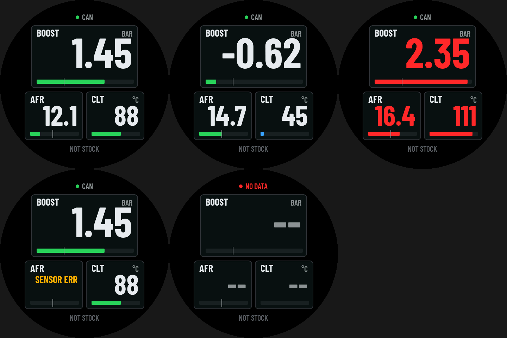

# NOT STOCK round gauge, ECUMaster EMU Black

The 2.1" round gauge of [`../notstock-round`](../notstock-round) (Waveshare
**ESP32-S3-Touch-LCD-2.1**, same board, same wiring, same NOT STOCK boot
logo) reading an **ECUMaster EMU Black** over its CAN stream instead of
OBD-II. One page so far: BOOST, AFR and CLT, drawn the way ECUMaster's own
dashes draw channels: a panel per value, label and unit at the top, the
value in a condensed face, a bar under it.



Normal, idle (cold engine: blue bar), alarm, sensor error, no data.

**State: built, decoder tested on a PC, the page checked in the simulator;
not tried on the car yet.**

## The page

| Panel | From the stream | Bar | Amber | Red, panel flashes |
| --- | --- | --- | --- | --- |
| BOOST, bar | MAP - BARO (base+0, base+2) | -1.0 .. 2.5, tick at 0 | from 1.8 | from 2.2 |
| AFR | lambda x 14.7 (base+3) | 10 .. 20, tick at 14.7 | under 11.2, over 15.2 | under 10.5, over 16.0 |
| CLT, degC | CLT (base+2) | 40 .. 120 | over 100 (blue under 60: cold) | from 108 |

- Before the EMU's barometer comes, boost is against 101.3 kPa.
- AFR is for petrol (`EMU_STOICH` in `main/ui_emu.h`).
- The EMU's error flags (base+4): MAP, wideband or CLT sensor failed puts
  SENSOR ERR in that panel instead of a value.
- A channel whose frame is older than 1 s shows `--`; no stream frame at
  all: NO DATA at the top, red.
- Limits, ranges and formats: the `CH[]` table in `main/ui_emu.c`.

## CAN

EMU Black: CAN-Bus -> EMU CAN stream on, base ID 0x600 (the default;
another one: `EMU_BASE_ID` in `main/emu_stream.h`). The stream is eight
frames, 11-bit IDs, little-endian, 20 Hz; `main/emu_stream.c` has the
table.

The bit rate is whatever the EMU is set to (125 k, 250 k, 500 k or 1 M):
the gauge finds it by listening at each rate in turn (listen-only, so a
wrong rate does nothing to the bus), then switches to normal mode at the
right one so it acknowledges the frames even when it is the EMU's only
partner on the bus. It never sends a frame. The rate found is stored and
tried first at the next start; if the stream goes quiet for 3 s it looks
again. The log says `EMU stream at N kbit`.

Wiring as on the OBD gauge: the SN65HVD230 board on GPIO20 (TX) / GPIO19
(RX), CAN-H / CAN-L to the EMU's CAN bus. The bus needs 120 R at both
ends; the EMU end is in the EMU harness, a gauge at the far end needs one
too.

## Build and flash

ESP-IDF 5.x, from this folder:

```
idf.py set-target esp32s3
idf.py build flash monitor
```

Flash and monitor over the board's "UART" USB-C. The board drivers, the
boot logo and the splash are `../notstock-round/main` (`hw.c`, `boot_fb.c`,
`splash.c`); the rest is here.

## On a PC

```
make -C tools/sim LVGL_DIR=/path/to/lvgl-8.4
tools/sim/build/sim out.ppm boost=1.45 afr=12.1 clt=88   # link=0, err=8 ...
python3 tools/topng.py out.ppm out.png
cc -Imain tools/test/test_stream.c main/emu_stream.c -lm && ./a.out
```

The simulator feeds the page real stream frames through the decoder.

Fonts: Barlow Condensed (SIL OFL, `../notstock-round/assets/fonts`), made
with lv_font_conv: `emu_num_120` / `emu_num_80` the digits, `emu_txt_28` /
`emu_txt_22` labels and units.
