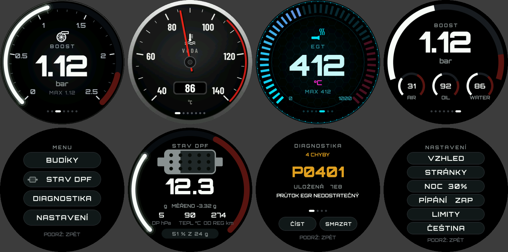

# NOT STOCK round gauge, LCD 1.85"

The round gauge of [`../notstock-round`](../notstock-round) on the Waveshare
**ESP32-S3-Touch-LCD-1.85** (360 x 360 LCD, ST77916 over QSPI, CST816
touch, PCM5101 audio with a speaker). Same UI, pages, looks, MULTI, DPF
status, diagnostics, settings and OBD/CAN code: this project builds the
sources of `../notstock-round/main` with its own board layer,
`main/hw_lcd185.c`, and Espressif's ST77916 driver (`main/st77916`, as in
Waveshare's demo).

The power and CAN board that sits behind it:
[`../notstock-can185`](../notstock-can185).

Not yet run on the board: built, and the scaled UI checked against the
simulator's frames. Pins from Waveshare's schematic of this board.

## One UI, scaled

The UI is laid out for 480 x 480. Here LVGL renders into a 480 x 480 frame
in PSRAM and every refresh goes to the panel scaled to 360 x 360: each
4 x 4 block of pixels becomes 3 x 3, area-weighted, so lines and text stay
smooth; only the part that changed is scaled and sent. The touch is scaled
the other way. Nothing in the UI knows about it.



## Build and flash

ESP-IDF 5.x, from this folder:

```
idf.py set-target esp32s3
idf.py build flash monitor
```

The board's USB-C is the ESP32-S3's own USB: flashing and the console go
there. Unplug the CAN board's battery wires from the display first.

## Pins

All in `main/board_lcd185.h`:

- ST77916: CLK 40, D0..3 46/45/42/41, CS 21; reset on the TCA9554's EXIO2;
  backlight PWM on GPIO5.
- I2C GPIO10/11: TCA9554 0x20, IMU, RTC. The CST816 touch (0x15, INT
  GPIO4, reset EXIO1) is on GPIO1/3 on this board; it is looked for on
  10/11 first, where later boards have it.
- PCM5101: BCK 48, LRCK 38, DOUT 47. The beep is a 2.4 kHz tone: three when
  a regeneration starts, one when it ends. Loudness: `BEEP_AMP` in
  `hw_lcd185.c`.
- CAN: through the display's 4-pin 1.0 mm UART socket, 1:1 on a JST SH
  cable to the CAN board: GPIO44 (socket pin 1, RXD) is CAN TX, GPIO43
  (pin 2, TXD) CAN RX. The console is on the USB; the boot loader is quiet.
- Power: 3.75 V into the display's battery socket from the CAN board, with
  the display's power button (Key1) bridged; see `../notstock-can185`.

The panel comes in two revisions with different set-up tables; the ID read
at start picks one, as Waveshare's demo does, and the log says which.

## If something is off

The console logs the I2C devices found (0x15 touch, 0x20 TCA9554, 0x51 RTC,
0x6B IMU), the panel ID, "CST816 ready", "PCM5101 ready". A missing one
points at that part; send the log.
