# NOT STOCK round gauge

One value at a time on a round display, swipe left / right for the next: water, oil, boost, intake, exhaust, engine
rpm. Long press anywhere for the menu: GAUGES, DPF STATUS, SETTINGS.
Double tap: night (backlight down), double tap again: day. Data comes over CAN the same way as on the 7" dash
(`../notstock-dash-7inch`: rusEFI broadcast, or OBD-II plus the VW UDS
measuring values on a T5.1), through an SN65HVD230 board on two free GPIOs.

Target board: **Waveshare ESP32-S3-Touch-LCD-2.1** (480 x 480, ST7701 on
RGB like the 7" dash, CST820 touch). The UI is laid out from the centre and
also builds for a 1.32" AMOLED at 466 x 466 (`-DRND_SIZE=466`, sim
`make SIZE=466`).

**State: first firmware for the board, not tried on it yet.** The UI is
real LVGL 8.4 code that also runs in the PC simulator; `main/hw.c` and
`main/can_obd.c` bring up the board and read the car over OBD-II (see
[Firmware](#firmware)).

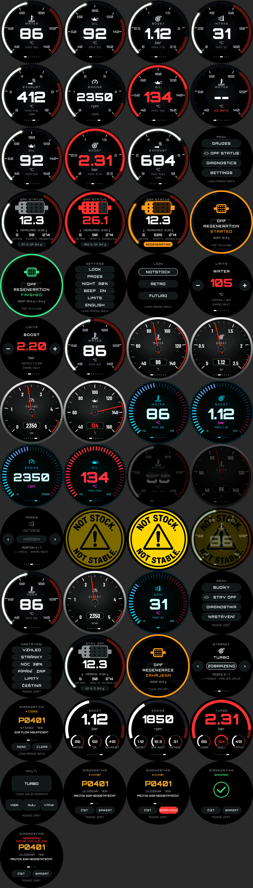

## The screen

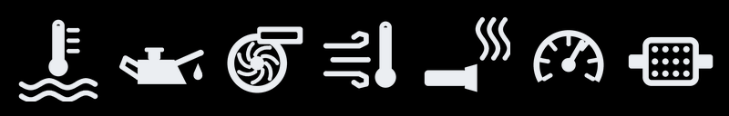

- **Pre-rendered faces** (`tools/gen_faces.py` -> `main/faces.c`): radial
  background, bezel line, the groove the value arc runs in, ticks, scale
  numbers, the page's icon. The title and unit are drawn live, since they
  follow the language. The red zone above the warn limit is
  drawn live over the groove, since the limit is a setting. One
  RGB565 image per page, 450 kB each in flash; nothing of it costs a frame.
- **Drawn live by LVGL** on top: the value arc with a two-layer glow, the
  readout (Orbitron Black 112, 84 for four digits), unit, peak since power-on
  (not for rpm) and the page dots. Over the limit arc, glow and number go
  red.
- EXHAUST and ENGINE scales are in hundreds / thousands (`x100`, `x1000`).
- Swipe changes the page; the arc sweeps up from the bottom of the new scale
  and the readout fades in.
- No CAN: `--` and NO DATA; a value the car does not give: NOT READ.
- Long press: the menu.

Pages, ranges, ticks and limits are the `PAGES` table in `gen_faces.py`
(written into `faces.h` for the UI); readout decimals and which pages keep a
peak are `FMT[]` in `ui_round.c`. Icons are vector drawings in the same
script (unit box 0..100), so they scale to any size.

Only one device may poll the OBD port: with the 7" dash on OBD-II as well,
one of the two has to listen only.

## Boot

  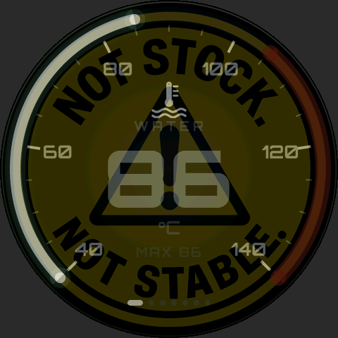

The NOT STOCK. / NOT STABLE. badge fills the round panel: it comes out of
black (1.2 s, eased), holds (1.5 s) and cross-fades into the gauges
(0.9 s), whose arc sweeps up as they appear. `ui_round_create(true)`; the
timings are `RND_BOOT_*` in `ui_round.h`. The logo is `tools/gen_splash.py`
from `assets/splash.png` (the same file and keying as the 7" dash), 456 px,
406 kB of RGB565 in flash.

On the panel the cross-fade is a full-screen blend per frame; if LVGL is too
slow for it there, the 7" dash's way (blending straight in the framebuffer,
`boot_anim.c`) is the fallback.

## Menu and DPF status

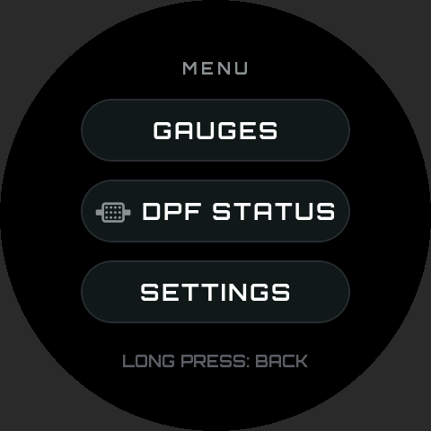 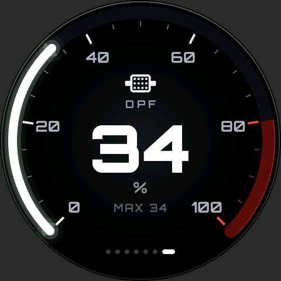

**DPF STATUS** (`ui_round_dpf.c`), from the VW measuring values the 7" dash
already reads (UDS 114F / 114E / 14F5 / 1156 / 1044):

- Outer arc and a filter drawing that fills from the inlet side: calculated
  soot mass, full at 40 g. White, amber from 70 % of the warn level, red over
  it. The warn level (24 g) is a guess until a regeneration is seen
  (`SOOT_WARN`).
- Readout in g, measured soot under it, then differential pressure, filter
  temperature and km since the last regeneration.
- The pill at the bottom: how full against the warn level, or REGENERATING.
- Swipe or long press to leave.

**Regeneration**: once the simulated filter temperature passes 400 degC
(`REGEN_TEMP`, ending 50 degC below), a popup comes up over whatever screen
is shown, with three beeps; when it ends, a green one with the soot before
and after and one beep. Tap closes it, otherwise it goes after 10 s. While
it lasts the gauges show DPF REGEN under the page dots, the DPF screen
glows orange, and the menu's DPF icon is orange.

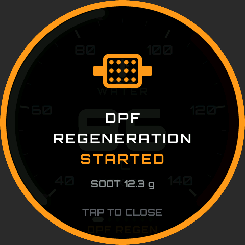 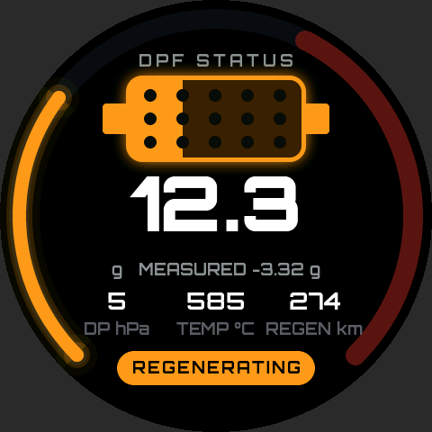

The beep is `rnd_beep()`, provided by the platform: on the Waveshare 2.1"
the buzzer sits on the TCA9554 expander (EXIO8).

## Looks

SETTINGS -> LOOK, applies at once. Menu, DPF status and settings stay the
same in every look.

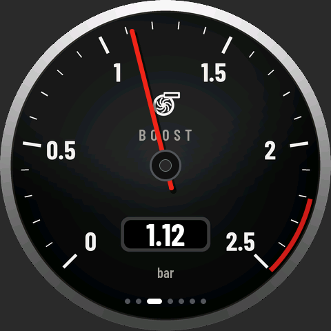 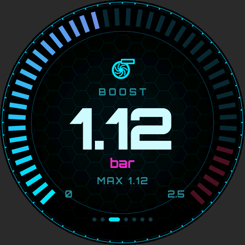

- **NOTSTOCK**: the faces above, glowing value arc.
- **RETRO** (`ui_look_retro.c`): a mechanical instrument of the VDO kind.
  Chrome bezel, black dial, white print, a glass sheen, all pre-rendered
  per page (`draw_face_retro` in `gen_faces.py`). Live: the red band from
  the warn limit, a red needle with a shadow over a black hub, a thin
  orange tell-tale needle left at the peak (none for rpm), and the value in
  a small window (Barlow Condensed, SIL OFL).
- **FUTURO** (`ui_look_futuro.c`): one shared background (black, a hex grid
  fading to the rim, thin cyan rings) and 46 segments that light up to the
  value, cyan into magenta; dim red past the warn limit, all red over it.
  Icon and title on top, a pale neon readout, the scale's ends underneath.

A look is three functions (`rnd_look_t` in `ui_round_int.h`: build, page,
draw); `ui_round.c` hands it the page and a smoothed value every frame.
Flash: NOTSTOCK and RETRO faces 2.8 MB each, FUTURO's background 450 kB.

## Settings

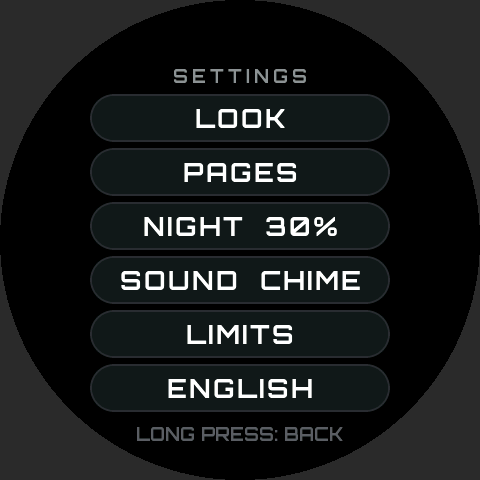 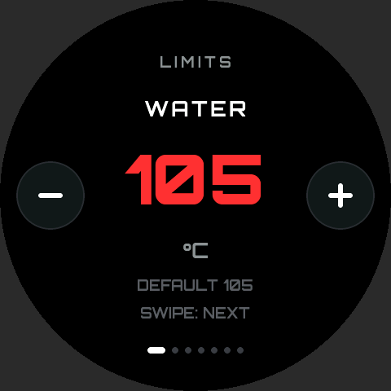

Menu -> SETTINGS (`ui_round_set.c`); a long press goes one level back and
stores them (`rnd_settings_save()`, the platform's NVS).

- **LOOK**: NOTSTOCK, RETRO, FUTURO.
- **PAGES**: one gauge at a time in swipe order: SHOWN / HIDDEN, `<` and
  `>` move it earlier or later, swipe for the next. The gauges then swipe
  through the shown ones only, and their dots count those; the last shown
  one cannot be hidden.
- **NIGHT 30 %**: the backlight at night, tap for the next step (10 to
  50 %). Night itself is a double tap on the gauges or the DPF screen; a
  toast says NIGHT 30 % or DAY for a second. Kept over power-off. The
  backlight is the platform's `rnd_backlight()`.
- **BEEP ON / OFF**: the regeneration beeps. The popup comes either way.
- **LIMITS**: one warn limit at a time, - and + (hold to repeat), swipe for
  the next: water, oil, boost, intake, exhaust, engine rpm, DPF soot. A
  gauge goes red over its limit and its red zone starts there; the DPF soot
  limit is what the DPF screen measures fullness against. Ranges, steps and
  defaults: `RND_LIMIT[]` in `ui_round_set.c`.
- **ENGLISH / ČEŠTINA**: the language, tap to switch. It shows in its own
  name, so it can be found either way. Every screen is built again in the
  new one at once (`rnd_lang_apply()`); kept over power-off.

## Czech

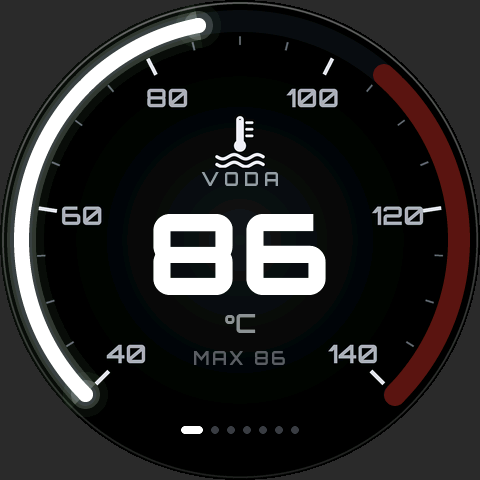 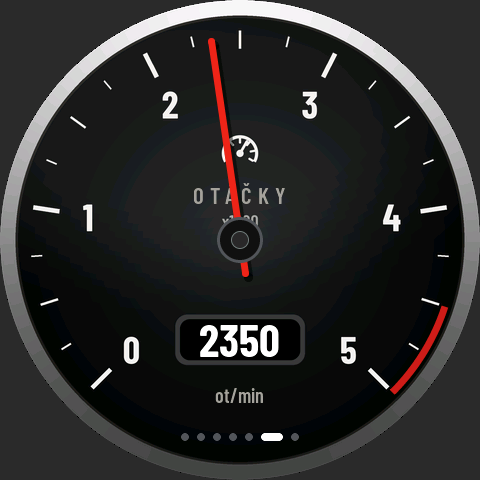
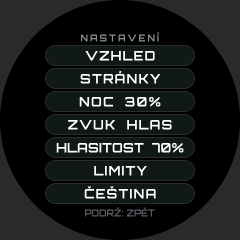 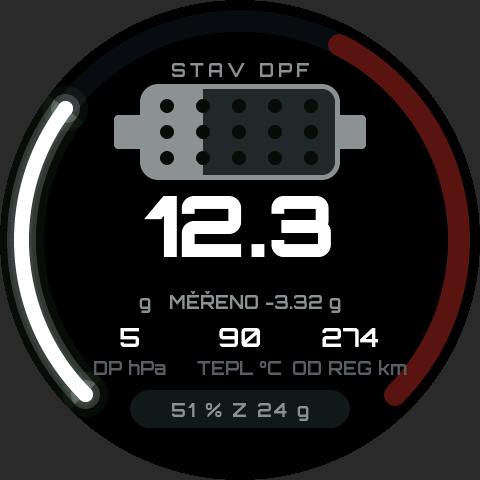

All text goes through `TR("ENGLISH", "ČESKY")` (`ui_round_int.h`), page
names and units through `rnd_page_name()` / `rnd_unit()` (`ui_round.c`):
VODA, OLEJ, TURBO, SÁNÍ, VÝFUK, OTÁČKY (ot/min), SAZE DPF. The UI is upper
case, so the fonts carry the Czech capitals only. Orbitron has no
Č Ď Ě Ň Ř Ť Ů: `tools/patch_font.py` builds them from its own C D E N R T U
and the caron / ring of Š and Å, into a renamed temporary copy (Orbitron
is a Reserved Font Name), which `gen_fonts.sh` converts. Barlow has them.

## MULTI

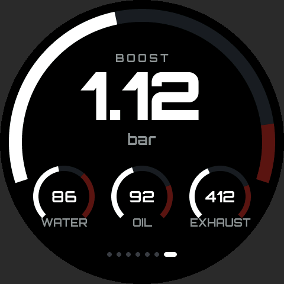 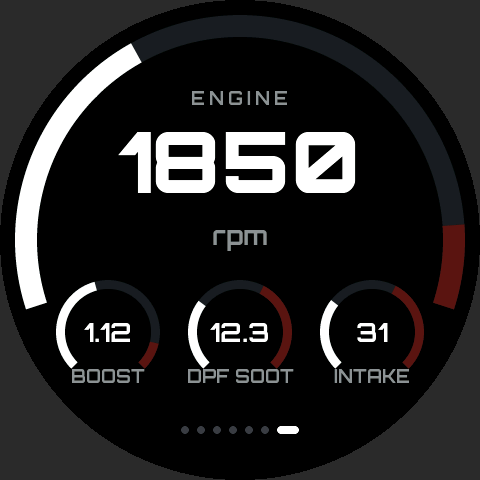
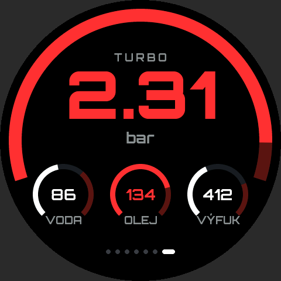 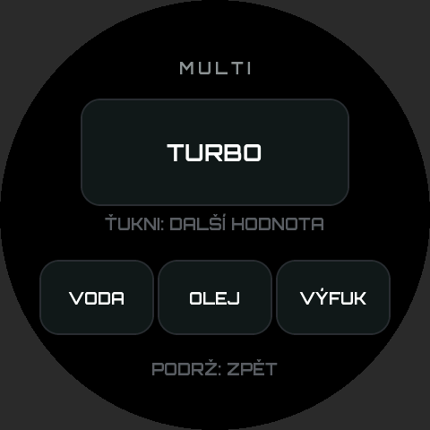

A page with four values at once, like a CAN Checked MFD's multi view: a big
one in the middle with an arc over the top, three small gauges in a row
below (`ui_round_multi.c`). Each has its red zone from its warn limit and
goes red over it. It takes its place in the swipe order like the gauges
(last by default) and can be hidden. What it shows: SETTINGS -> PAGES ->
MULTI -> EDIT, tap a slot for the next value (water, oil, boost, intake,
exhaust, rpm, DPF soot; the small ones can be empty). Default: boost big,
water, oil and exhaust small.

## Diagnostics

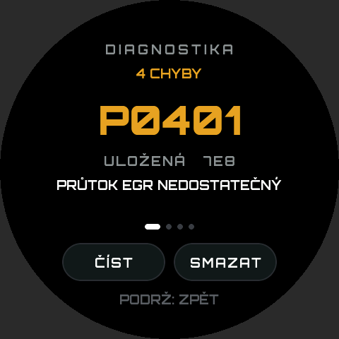 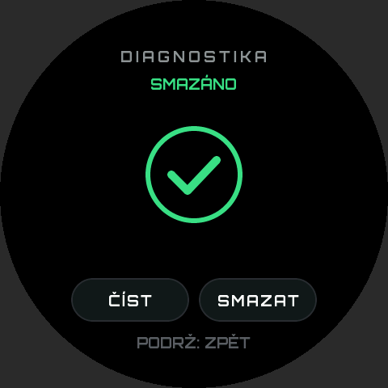
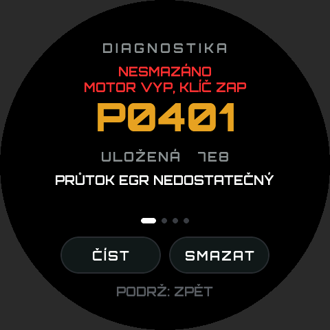

Menu -> DIAGNOSTICS (`ui_round_diag.c`): the OBD trouble codes. Opening it
reads them (mode 03 stored, 07 pending, every ECU on 0x7DF), one code at a
time: the code, stored (amber) or pending (grey), which ECU, and what it
means (`dtc_text.c`, shared with the 7" dash, the common diesel codes in
English and Czech; others get their group). Swipe for the next code.
READ reads again; CLEAR turns red and asks once more, then clears (mode 04)
and reads again. With the engine running the ECU refuses, and the screen
says to switch the engine off and leave the ignition on.

The platform does the OBD work (the 7" dash's `obd2.c`, tested on the
T5.1): `rnd_dtc_read()` / `rnd_dtc_clear()` start it, and `rnd_data_t.dtc`
brings the state and the list back every frame.

## Bluetooth

The gauge will send its values over Bluetooth LE: gauges 10 times a
second, the particulate filter once a second (`docs/BLE.md`, packed by
`main/ble_proto.c`). NOT STOCK Live (`../notstock-app`) shows and logs
them in a browser.

## In the van

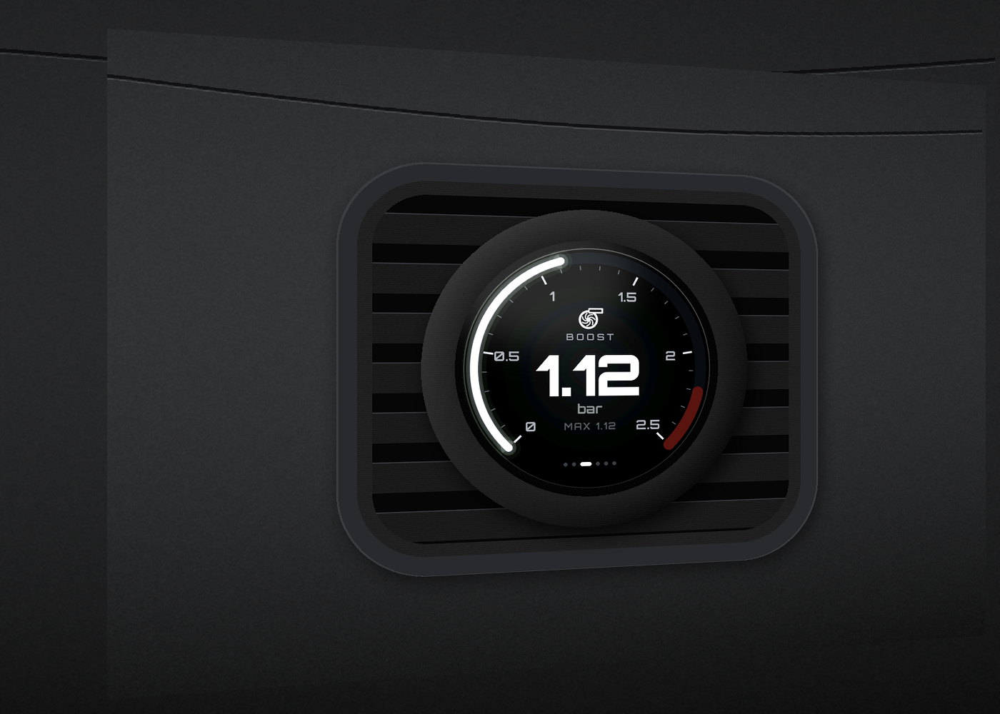

A mock-up of the gauge in the VW T5.1's left outer air vent, held by a 3D
printed grille (`tools/mockup_t5.py`, all three looks in
`preview/mockup-t5-looks.png`). Stylised, not measured: the vent is taken
as a rounded rectangle about 95 x 80 mm, the grille's round boss 70 mm, the
display's active area 53 mm. The printable grille needs the real opening
and the board's outline first.

## Firmware

ESP-IDF 5.x project, LVGL from the component manager. It uses the OBD-II
client and the trouble code texts of the 7" dash (`../notstock-dash-7inch/main/
obd2.c`, `dtc_text.c`) as they are, so keep both folders side by side.

    idf.py set-target esp32s3
    idf.py build
    idf.py -p COMx flash monitor

- `main/board_round.h`: the pin map. ST7701 set up over bit-banged 3-wire
  SPI (GPIO1/2, CS and reset on the TCA9554), then RGB at 16 MHz; CST820
  touch and the TCA9554 on I2C (GPIO7/15); backlight PWM on GPIO6; buzzer on
  EXIO8. If a tap lands mirrored, flip `TOUCH_*` there.
- `main/hw.c`: the drivers, `main/can_obd.c`: TWAI and the OBD client,
  `main/main.c`: settings in NVS, the platform hooks of `ui_round.h`, the
  30 Hz feed into the UI.
- `main/boot_fb.c`: on the board the boot logo is written straight into
  the frame buffer (fade in, then a cross-fade into the gauge LVGL has
  rendered behind it). Through LVGL every step redrew the whole screen and
  the fade stuttered; the simulator still shows the LVGL version.
- No Wi-Fi, no Bluetooth.
- New source files are picked up at configure time: after adding one,
  `idf.py reconfigure` (or `fullclean`).

**In the car everything goes through the 12-pin connector** (Waveshare's
"12PIN wire interface"): GND, VBus (5 V), D- (GPIO19), D+ (GPIO20), GND,
3V3, SCL, SDA, TXD (GPIO43), RXD (GPIO44), NC, GPIO0.

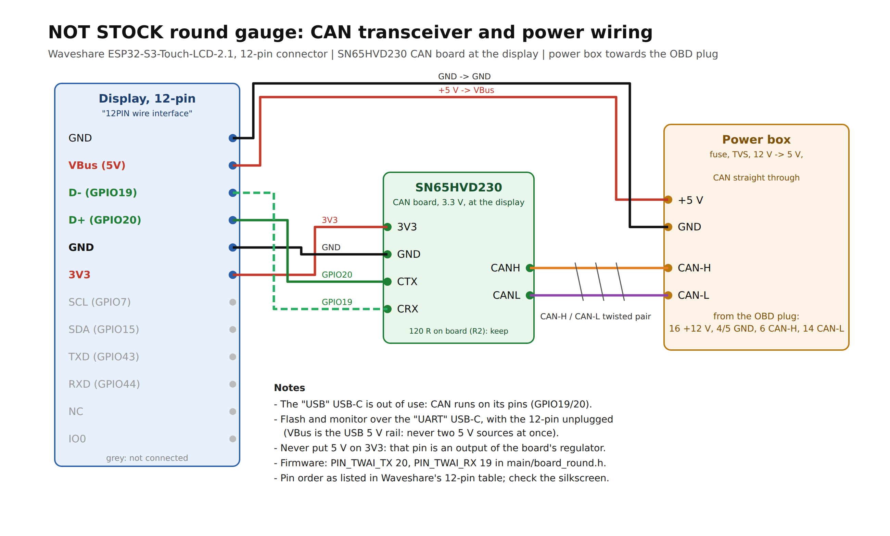

(`docs/wiring.svg` is the source.)

| 12-pin | to |
|---|---|
| VBus (5V) + GND | +5 V and GND from the power box |
| D+ (GPIO20) | SN65HVD230 CTX |
| D- (GPIO19) | SN65HVD230 CRX |
| 3V3 + GND | SN65HVD230 3V3, GND |

CAN uses the native USB's pins, as on the 7" dash: the bottom "USB" USB-C
is dead for it while the transceiver is wired. Flash and monitor over the
"UART" USB-C; the console stays on UART0 (GPIO43/44). That also keeps CAN
clear of the boot ROM, which prints a few lines on GPIO43 at every reset.

The SN65HVD230 sits at the display, so only 5 V, GND, CAN-H and CAN-L run
to the box. VBus is the USB 5 V rail: with the box connected, do not plug a
computer into the board as well, unplug the 12-pin to flash.

Not done yet: sleep when the car is off. The gauge polls the ECU all the
time, so for now unplug it when parked.

## Preview on the PC

    LVGL_DIR=/path/to/lvgl-8.4 python tools/preview.py
    LVGL_DIR=/path/to/lvgl-8.4 python tools/preview.py page=2 boost=1.8
    LVGL_DIR=/path/to/lvgl-8.4 python tools/preview.py screen=dpf regen=start
    LVGL_DIR=/path/to/lvgl-8.4 python tools/preview.py screen=limits limit=2

Writes `preview/*.png`. After changing pages or artwork:
`python tools/gen_faces.py` (add `--size 466` for the AMOLED). Fonts:
`sh tools/gen_fonts.sh` (Orbitron and Barlow Condensed, SIL OFL,
`assets/fonts`; needs lv_font_conv and fontTools). Czech in the sim:
`lang=1`.
